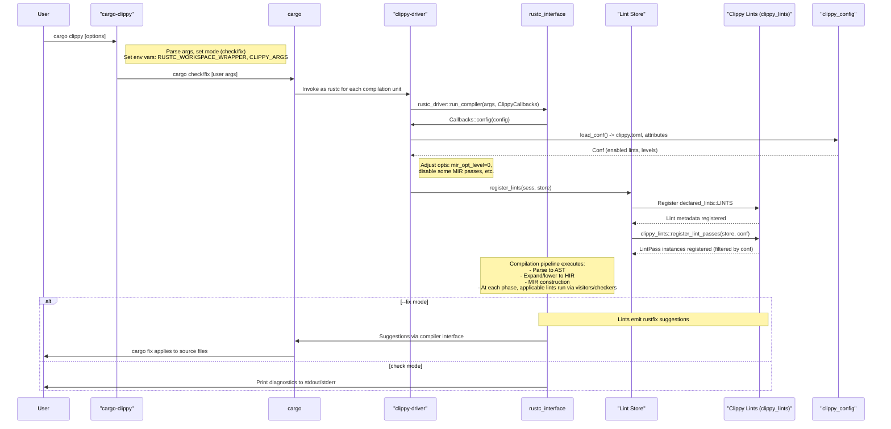

# High-Level Design of Workflow #1: cargo-clippy

## Overview

The \"cargo-clippy\" workflow enables running Clippy as a Cargo subcommand (`cargo clippy`) to lint Rust code in Cargo projects, including workspaces and optionally dependencies. It catches common mistakes, suggests improvements, and can auto-fix issues via `--fix`. 

This workflow wraps Cargo's `check` or `fix` commands, injecting Clippy into the Rust compiler pipeline by setting `RUSTC_WORKSPACE_WRAPPER` to `clippy-driver` and passing Clippy-specific arguments via `CLIPPY_ARGS`. During compilation, Clippy's lints are registered and executed at various stages (AST, HIR, MIR), emitting diagnostics based on configuration from CLI, `clippy.toml`, and code attributes.

Inputs include project directory (Cargo.toml), flags (e.g., `--all-targets`, `--fix`), env vars (e.g., `RUSTFLAGS`), and config files. Outputs are lint messages, potential source modifications, and exit codes.

Entry point: `src/main.rs` (cargo-clippy binary).

## Components

- **cargo-clippy (`src/main.rs`)**: Handles CLI parsing, determines subcommand (`check` or `fix` based on `--fix`), constructs environment variables, and spawns `cargo` process.

- **clippy-driver (`src/driver.rs`)**: Custom Rust compiler driver extending `rustc_driver`. Uses `ClippyCallbacks` to:
  - Load configuration.
  - Register Clippy lints with the `LintStore`.
  - Adjust compiler options (e.g., `mir_opt_level = 0` for unoptimized MIR analysis, disable certain passes).
  - Track dependencies (e.g., `clippy.toml`, `CLIPPY_ARGS`) for Cargo rebuild triggers.

- **clippy_lints**: Core library implementing ~750 lints. 
  - `declared_lints::LINTS`: Array of all lint metadata.
  - Modular implementations in submodules (e.g., `methods/`, `misc_early/`, `operators/`).
  - `register_lint_passes(store, conf)`: Registers `rustc_lint::LintPass` instances, filtered by config.

- **clippy_config**: Parses hierarchical configuration from `clippy.toml` files, inline attributes (`#[allow(clippy::lint)]`), and CLI flags to set lint levels (allow, warn, deny, forbid) and groups.

- **clippy_utils**: Utilities for lint authors, including AST/HIR/MIR queries, type comparisons, symbol matching, etc., to share common logic.

- **rustc_tools_util**: Provides version information, environment setup helpers, and utilities for interacting with Rustc internals.

- **declare_clippy_lint**: Macro crate for declaring lint structs with metadata (name, level, description, etc.).

## Sequence Diagram

The following Mermaid sequence diagram illustrates the primary flow of information and control in the cargo-clippy workflow:

## Configuration and Customization

- **Loading**: In `clippy-driver`, `clippy_config::Conf::read()` aggregates config from:
  - Project-local `clippy.toml`.
  - Ancestor directories.
  - Code attributes.
  - CLI flags passed via `CLIPPY_ARGS` (e.g., `-W clippy::perf`).
- **Application**: Used to filter and level lints during registration. Supports groups (correctness, style, perf, etc.) and MSRV specifications.
- **Tracking**: Config files and env vars are added to `ParseSess`'s depinfo for incremental builds.

## Lint Execution Details

- **Phases**: Lints are categorized and run at specific compiler stages:
  - Early (pre-type-check): AST visitors in `misc_early/`.
  - Post-type-check: HIR/MIR analyses in other modules.
- **Implementation**: Each lint is a struct implementing `rustc_lint::LintPass` (or early variant), defining `get_lints()` and visitor/check methods. Late lints, for example, may use span information like `expr.span.desugaring_kind()` to skip compiler-generated code, as in the `disallowed_methods` lint updated by PR #16186 to ignore desugared expressions and reduce false positives.
- **Diagnostics**: Emit via `sess.emit_warning()`, `emit_error()`, etc., with spans, explanations, and optional fixes.
- **Fixes**: Many lints integrate with `rustfix` for `--fix` mode, generating edit suggestions applied by `cargo fix`.

## Additional Design Aspects

- **Wrapper Mode Handling**: `clippy-driver` detects if invoked as `rustc` wrapper (via Cargo) and adjusts args. Supports direct invocation or delegation (`--rustc`).
- **Optimization Trade-offs**: Disables optimizations like MIR passes and format_args flattening for accurate linting, potentially increasing compile time.
- **Skip Conditions**: Bypasses Clippy for Cargo metadata queries, cap-lints=allow (unless forcing Clippy), or irrelevant packages in --no-deps mode.
- **Error Reporting**: Integrates with rustc's diagnostics; ICEs report to GitHub issues with version info.
- **Development Features**: Tracks driver executable in debug mode for rebuilds during development.
- **Dependencies**: Relies on `rustc_private` for compiler internals; must sync with Rust releases.

This design provides tight integration with the Rust toolchain, enabling powerful static analysis while maintaining Cargo compatibility.