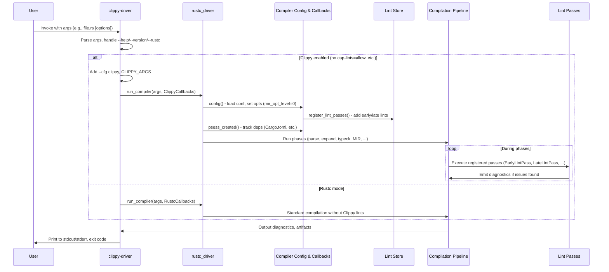
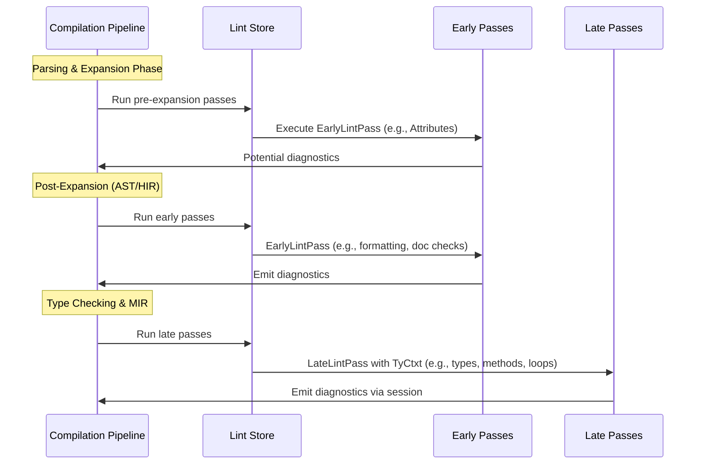

# High-Level Design of the clippy-driver Workflow

## Overview

The clippy-driver workflow enables direct invocation of Clippy as a Rust compiler driver, providing an interface similar to \`rustc\` for linting individual Rust source files (.rs) or crates in non-Cargo environments, such as custom build scripts, IDE integrations, or standalone analysis tools. It serves as the core execution engine behind \`cargo clippy\` (via the \`RUSTC_WRAPPER\` environment variable) but can be run independently.

Key characteristics:
- **Inputs**: Rust source files, rustc-compatible CLI arguments (e.g., \`--edition\`, \`--target\`), optional sysroot, configuration via \`clippy.toml\` or env vars like \`CLIPPY_ARGS\`.
- **Outputs**: Lint diagnostics (warnings, errors, suggestions) emitted to stdout/stderr, optional compiled artifacts (e.g., binaries, LLVM IR) if compilation proceeds.
- **Entry Point**: \`src/driver.rs\` – processes arguments, decides on Clippy activation, and orchestrates the compilation via \`rustc_driver\`.
- **Core Mechanism**: Acts as a drop-in replacement for \`rustc\`, customizing the compiler session to register Clippy's lints, adjust optimization levels (e.g., MIR opt level 0 for precise analysis), and execute analysis passes during compilation phases.
- **Decision Logic**: Skips Clippy lints if all are capped to \`allow\` or in certain Cargo info queries; falls back to plain \`rustc\` behavior.
- **Dependencies**: Leverages \`clippy_lints\` for lint implementations, \`clippy_utils\` for analysis helpers, and \`clippy_config\` for settings.

This workflow ensures deep integration with Rust's compiler pipeline, allowing lints to access internal representations (AST, HIR, MIR, TyCtxt) for sophisticated checks impossible in external tools.

## Components

- **Argument Processing (src/driver.rs)**: Parses CLI args using \`rustc_driver::args::raw_args\`, handles special modes (\`--rustc\` delegates to rustc, \`--help\`/\`--version\`), injects Clippy-specific flags (e.g., \`--cfg clippy\`) from \`CLIPPY_ARGS\`.
- **Callbacks (ClippyCallbacks / RustcCallbacks)**: Implement \`rustc_driver::Callbacks\`; customize config (lint registration, unstable opts), session creation (dependency tracking for Cargo rebuilds, e.g., Cargo.toml, clippy-driver exe).
- **Lint Registry (clippy_lints/src/lib.rs)**: \`register_lint_passes\` populates \`rustc_lint::LintStore\` with:
  - Deprecated/renamed/removed lints.
  - Pre-expansion passes (e.g., attribute collection).
  - Early passes (AST/HIR-based, e.g., formatting, doc checks).
  - Late passes (typed analysis, e.g., type checks, method calls).
  - Supports conditional enabling via \`Conf\`.
- **Configuration Loader (clippy_config)**: \`Conf::read\` parses \`clippy.toml\`, inline attributes (\`#[allow(clippy::lint)]\`), CLI overrides; influences lint levels and params.
- **Lint Utilities (clippy_utils)**: Reusable functions for lints (e.g., type queries, def path matching, expression analysis).
- **Rustc Infrastructure**: \`rustc_driver\`, \`rustc_interface\`, \`rustc_session\` for session management, diagnostics; \`rustc_lint\` for pass registration.
- **Development Helpers**: Tracks files/envs for incremental builds; ICE hook for bug reporting to GitHub.

## Main Execution Flow

The primary sequence illustrates invocation, mode decision, and compiler orchestration.

## Lint Registration and Execution Flow

Clippy registers passes tailored to compiler phases; execution occurs interleaved with compilation.

### Registration Details
- **Deprecated Handling**: Registers renames/removals for backward compatibility.
- **Early Passes**: ~50+ implementations for syntax/style checks (e.g., \`DoubleParens\`, \`Formatting\`).
- **Late Passes**: ~300+ for semantic analysis (e.g., \`Types\`, \`Methods\`, \`Loops\`), using \`TyCtxt\` for context. These passes often include logic to skip analysis on desugared (compiler-generated) code, e.g., via \`expr.span.desugaring_kind().is_some()\`, as implemented in the \`disallowed_methods\` lint (updated in PR #16186) to avoid false positives on features like \`async\` desugaring to \`Future::poll\`.
- **Shared State**: Some passes share storage (e.g., \`FormatArgsStorage\`) across lints.

### Execution Sequence

## Other Relevant High-Level Design Aspects

- **Performance Considerations**: MIR opt level set to 0 avoids optimizations that could obscure bugs (e.g., constant folding); disables specific passes like \`CheckNull\`. Trade-off: Slower compilation for accuracy.
- **Incremental Compilation**: Tracks runtime-accessed files (Cargo.toml, clippy.toml, driver exe) in \`file_depinfo\` and envs (CLIPPY_CONF_DIR, CLIPPY_ARGS) for Cargo-triggered rebuilds.
- **Configuration Flexibility**: Hierarchical (CLI > file > attributes); supports lint groups, custom params (e.g., max nesting depth).
- **Fallback and Compatibility**: Supports plain rustc delegation for queries or suppressed lints; handles arg files (\`@path\`), sysroot env.
- **Extensibility**: Lints implement traits like \`EarlyLintPass\` or \`LateLintPass\`; new ones added via dev tools, auto-registered in \`lib.rs\`.
- **Diagnostics**: Leverages rustc's system for structured output (spans, suggestions via rustfix); colorized via anstream.
- **Limitations**: Tied to rustc version (via \`rustc_private\`); requires nightly for dev; no built-in fix mode (use cargo clippy --fix).
- **Testing Integration**: Used in UI tests, dogfooding; ensures lints trigger correctly in direct mode.

This design draws from source analysis of \`src/driver.rs\`, \`clippy_lints/src/lib.rs\`, and cross-references with project architecture in \`project-overview.md\`. For implementation details, see relevant crates' READMEs and Rustc driver docs.