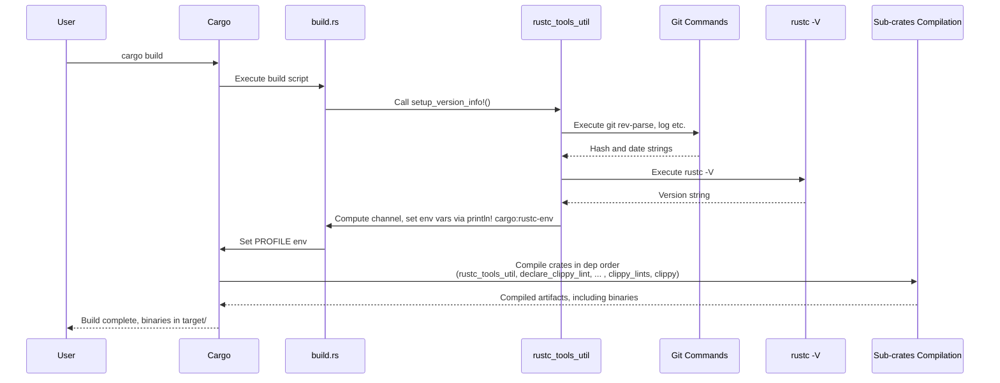
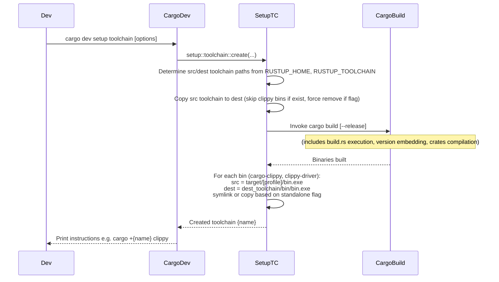

# High-Level Design of the "build-source" Workflow

## Overview

The \"build-source\" workflow compiles the Clippy project from source, producing the core binaries `cargo-clippy` and `clippy-driver`. Clippy is structured as a set of interdependent Rust crates managed via path dependencies in their `Cargo.toml` files, effectively forming a workspace-like build environment without an explicit `[workspace]` section.

The primary mechanism is Cargo's build system (`cargo build`), triggered directly or via development tools like `cargo dev setup toolchain` from the `clippy_dev` crate. This process requires a Rust nightly toolchain (pinned in `rust-toolchain.toml`) with components such as `rust-src` and `rustc-dev` to access internal compiler APIs via `rustc_private`.

During the build, the root `build.rs` script embeds version metadata—including git commit hash, date, and compiler channel—using utilities from `rustc_tools_util`. The resulting binaries are placed in `target/debug/` (default) or `target/release/` (with `--release`).

For developer convenience, `cargo dev setup toolchain` not only builds but also creates a custom rustup toolchain (default name: `clippy`) by copying the base toolchain and installing the fresh binaries via symlinks or copies.

Key files:
- `Cargo.toml` (root): Defines binaries and path dependencies.
- `build.rs` (root): Custom build logic for version info.
- `rustc_tools_util/src/lib.rs`: Provides version querying macros.
- `clippy_dev/src/setup/toolchain.rs`: Implements toolchain setup and installation.
- `rust-toolchain.toml`: Toolchain pinning and components.
- `clippy_dummy/`: Placeholder crate (not built in this workflow; panics if attempted, used historically for crates.io publishing).

Outputs:
- Compiled binaries in `target/`.
- Optional: Installed custom toolchain for use via `cargo +clippy clippy`.

## Components

- **Cargo**: The build system orchestrates compilation based on the dependency graph.
- **Root `Cargo.toml`**: Specifies package metadata, binaries (`cargo-clippy` from `src/main.rs`, `clippy-driver` from `src/driver.rs`), path dependencies (e.g., `clippy_lints = { path = \"clippy_lints\" }`), and build dependencies.
- **Root `build.rs`**: Runs during build to set `PROFILE` environment variable and invoke `rustc_tools_util::setup_version_info!()` for embedding git and compiler info as compile-time constants.
- **rustc_tools_util**: Utility crate for:
  - Querying git (via `git rev-parse HEAD`, `git log --date=short`) for commit hash and date.
  - Querying `rustc -V` for channel detection (nightly, beta, etc.).
  - Setting `cargo:rustc-env` vars and handling `cargo:rerun-if-changed` for git files.
  - Macro `get_version_info!()` used in code for `--version` output.
- **Path-dependent Crates**:
  - `declare_clippy_lint`: Macros for declaring lint metadata.
  - `clippy_config`: Parses configuration (e.g., `clippy.toml`).
  - `clippy_utils`: Shared utilities for lint logic (e.g., type queries, pattern matching).
  - `clippy_lints`: Implements hundreds of lints; depends on the above crates.
  - `clippy_dev`: Provides `cargo dev` subcommands, including `setup toolchain` for build + install.
- **clippy_dummy**: Dummy package with erroring build.rs and panicking main.rs; not part of standard build (renamed historically for publishing).
- **rust-toolchain.toml**: Ensures consistent nightly build environment with required components (`rustc-dev` for `rustc_private`, `llvm-tools` for optimizations, etc.).
- **Binaries**:
  - `cargo-clippy`: CLI entrypoint wrapping Cargo with Clippy configuration.
  - `clippy-driver`: Custom Rustc driver registering Clippy lints.

## Cargo Build Sequence Diagram

This diagram illustrates the internal flow during `cargo build`, focusing on version embedding and compilation.

## Setup Toolchain Sequence Diagram

This higher-level diagram shows the full development workflow via `cargo dev setup toolchain`, which encompasses building and installing into a custom toolchain.

## Additional High-Level Design Aspects

### Build Dependency Graph

Cargo resolves and builds crates topologically:
1. **Build Dependencies**: `rustc_tools_util` (used in `build.rs`).
2. **Leaf Crates**: `declare_clippy_lint` (minimal external deps).
3. **Utility Crates**: `clippy_utils` (depends on `declare_clippy_lint`), `clippy_config`.
4. **Core Lint Crate**: `clippy_lints` (depends on `clippy_utils`, `clippy_config`, `declare_clippy_lint`, external like `regex-syntax`).
5. **Development Crate**: `clippy_dev` (built if invoked, depends on various).
6. **Root Crate**: `clippy` (depends on `clippy_lints`, `clippy_utils`, `clippy_config`, `declare_clippy_lint`; produces binaries).

This ensures lints and utils are available for the driver and CLI.

### Version Information Flow

- **Queries**: Git for source control metadata; `rustc` for host compiler details.
- **Embedding**: Environment variables set via `cargo:rustc-env` become accessible in code as `env!()` macros (e.g., `env!("GIT_HASH")`).
- **Output**: Used in `VersionInfo` struct for `clippy --version` display, including crate version + commit info.
- **Rebuild Triggers**: `rerun_if_git_changes()` adds `cargo:rerun-if-changed` for git HEAD and ref files.

### Toolchain and Environment Considerations

- **Pinned Toolchain**: `rust-toolchain.toml` enforces a specific nightly with `profile = "minimal"` and essential components to minimize download size while enabling `rustc_private` usage.
- **rustc_private Dependency**: Requires `rustc-dev` component; Clippy syncs with Rust releases via `clippy_dev/src/sync.rs` (separate workflow).
- **Features**: Optional features like `internal` (adds `clippy_lints_internal`), `integration` (adds `tempfile` for tests).
- **Standalone Mode**: In setup, copies binaries for self-contained toolchains (vs. symlinks which track source changes).
- **Error Handling**: Build fails if git/rustc queries fail critically; defaults to empty values where possible.

### Edge Cases and Best Practices

- **No Git Repo**: Version info falls back to package version only.
- **Custom Toolchains**: Ensure matching components; mismatches cause compile errors due to API changes.
- **Release Builds**: Use `--release` for optimized binaries, but debug recommended for development.
- **MSRV (Minimum Supported Rust Version)**: Individual crates may specify lower MSRV; root aligns with Rust stable where possible.
- **Testing Integration**: Post-build, run `cargo test` or `cargo dev dogfood` to validate (separate workflow).

This design leverages Cargo's strengths for modular builds while customizing for compiler integration and version tracking. For updates, monitor Rust toolchain changes and use `cargo dev sync`.