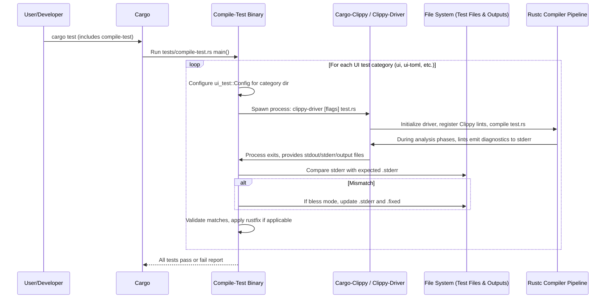
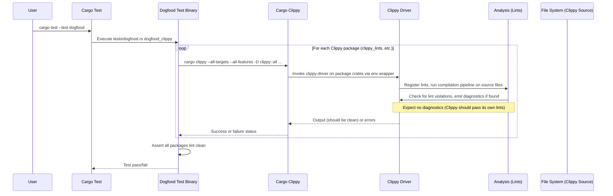

# High-Level Design of the Testing Workflow in Clippy

## Overview

The testing workflow in Clippy is designed to validate the correctness, reliability, and self-consistency of the linter through a multi-faceted approach. It includes:

- **Unit Tests**: Standard Rust unit and integration tests defined within the source modules of various crates (e.g., `#[test]` functions in `clippy_lints/src/`).
- **UI (User Interface) Tests**: Compile and output-matching tests that simulate real lint triggers. These are categorized into standard UI tests, internal UI tests, TOML-configured tests, and Cargo project simulations. Managed by `tests/compile-test.rs` using the `ui_test` framework.
- **Dogfooding Tests**: Ensures Clippy adheres to its own lints by running `cargo clippy` with strict deny-all flags on Clippy's own crates. Implemented in `tests/dogfood.rs`.
- **Additional Checks**: Formatting enforcement (`tests/check-fmt.rs`), configuration consistency, symbol usage validation, and metadata collection for documentation.

Tests are invoked primarily via `cargo test`, which builds and executes test binaries like `compile-test` and `dogfood`. The workflow supports blessing mechanisms to update expected outputs (`cargo uibless` or `--bless`), speed testing for performance, and integration with CI pipelines. During UI tests, diagnostic metadata is collected to generate lint documentation for the Clippy website.

This comprehensive testing suite ensures that new lints, updates to existing ones, and compiler API changes do not introduce regressions, false positives, or violations in Clippy itself.

## Key Components

- **tests/compile-test.rs**: Binary that orchestrates all UI test categories using `ui_test`. Configures `ClippyConfiguration`, sets up `clippy-driver` invocations, handles comparisons of compiler outputs (`.stderr`, `.fixed`), and collects applicability data for lints.
- **tests/dogfood.rs**: Test binary that runs `cargo clippy` on Clippy's internal crates (e.g., `clippy_lints`, `clippy_utils`) with `-D clippy::all -D clippy::pedantic` to enforce self-linting.
- **clippy_dev/src/dogfood.rs**: Provides `cargo dev dogfood` subcommand to conveniently run dogfooding with options like `--fix`, `--allow-dirty`.
- **tests/ui/**, **tests/ui-internal/**, **tests/ui-toml/**, **tests/ui-cargo/**: Directories containing test cases (.rs files with expected `.stderr` and optional `.fixed` for auto-fixes).
- **tests/check-fmt.rs** and other utility tests (e.g., `config-consistency.rs`, `symbols-used.rs`): Ensure code style, config validity, and dependency usage.
- **Cargo.toml (root)**: Defines test binaries like `[[bin]] name = "compile-test"` and dependencies like `ui_test`.
- **clippy.toml (tests/)**: Configuration for test runs.
- **ui_test crate**: External dependency for managing UI test execution, file filtering, output normalization, and blessing.
- **Diagnostic Collector**: Thread in `compile-test.rs` that aggregates lint applicabilities from test diagnostics to produce `util/gh-pages/lints.json` and `index.html`.

Supporting crates like `clippy_lints`, `clippy_utils` are indirectly involved as they provide the lints and helpers used during test compilations.

## UI Tests Sequence Diagram

UI tests verify lint behavior by compiling test snippets and matching emitted diagnostics against expected outputs.

## Dogfooding Tests Sequence Diagram

Dogfooding applies Clippy's lints to its own source code to ensure consistency and catch self-violations.

## Unit and Integration Tests

Unit tests are embedded in source files across crates (e.g., `clippy_utils/src/tests.rs`) and focus on isolated logic like type checks or pattern matching. They are executed via `cargo test` on specific crates or the workspace.

Integration tests in `tests/` (e.g., `versioncheck.rs`, `workspace.rs`) validate broader behaviors like workspace handling or version compatibility.

## Additional High-Level Aspects

- **Blessing and Maintenance**: Expected test outputs (`.stderr`, `.fixed`) are updated via `cargo uibless` or `--bless` flag when test behaviors change (e.g., new lint messages). This ensures tests remain golden and reflect intended behavior.
- **Performance Testing**: Environment variables like `SPEEDTEST=ui` in `compile-test.rs` allow benchmarking test suite execution times.
- **CI Integration**: Tests run in CI with features like `internal` for full coverage. `lintcheck` (separate workflow) complements by testing on external crates.
- **Metadata Generation**: During UI tests, a collector thread parses diagnostics to determine fix applicabilities, generating documentation files like `util/gh-pages/index.html` with lint details, groups, and configurations.
- **Customization**: Tests support Rust editions, custom flags (e.g., `rustfix` modes), dependency building via `clippy_test_deps`, and environment overrides for sysroot/debuginfo.
- **Edge Cases**: Handles multi-crate workspaces, config inheritance, Cargo.toml metadata validation, and internal dependencies via `--extern` flags.

This design promotes thorough validation while accommodating Clippy's tight coupling with Rustc internals and large test volume (thousands of UI tests).

