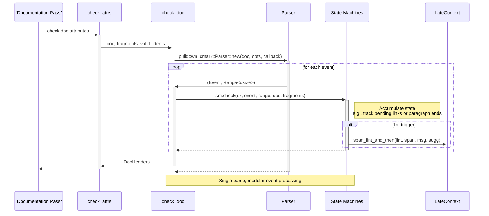

# High-Level Design of Workflow #5: Lint Development

## Overview

The lint-development workflow enables developers to create, modify, and integrate new lints into Clippy. A lint is a static analysis rule that detects specific patterns or issues in Rust code, providing diagnostics and often suggestions or fixes. This workflow automates much of the boilerplate through tools in the \`clippy_dev\` crate, ensuring consistency in declaration, registration, and testing. Key steps include scaffolding new lint files and tests, implementing the analysis logic using compiler APIs, testing via UI tests and dogfooding, and updating generated registration files via \`cargo dev update_lints\`. This integrates the lint into Clippy's compilation pipeline, making it available via \`cargo clippy\`.

From analysis of source code (e.g., \`clippy_dev/src/new_lint.rs\`, \`clippy_dev/src/update_lints.rs\`, \`clippy_lints/src/lib.rs\`, \`src/driver.rs\`), the workflow leverages Rust's compiler internals for deep analysis, with lints running as passes at early (pre-type-check) or late (post-type-check) stages. The \`declare_clippy_lint!\` macro handles metadata, and generated files ensure automatic inclusion.

## Components

- **clippy_dev**: CLI tools (\`cargo dev\`) including \`new_lint\` for scaffolding and \`update_lints\` for generating registration code from parsed lint declarations.
- **clippy_lints**: Core library housing all lint implementations as structs implementing \`rustc_lint::EarlyLintPass\` or \`LateLintPass\`. Each lint file (\`src/<lint>.rs\` or in submodules like \`methods/\`) contains a \`declare_clippy_lint!\` invocation defining metadata (name, level, category, description, version, location).
- **declare_clippy_lint**: Crate providing the macro for lint declaration (generates \`Lint\` static and \`LintInfo\`) and \`LintListBuilder\` for bulk registration of individual lints and groups (e.g., \`clippy::all\`, \`clippy::correctness\`).
- **clippy_utils**: Shared utilities for common lint tasks (e.g., type queries, def path matching, expression analysis).
- **tests/ui/**: UI test infrastructure where each lint has a subdirectory with input \`.rs\` files and expected \`.stderr\` outputs (and \`.fixed\` for fixes) from Clippy runs to verify diagnostics.
- **clippy-driver** (in root \`src/driver.rs\`): Custom compiler driver that loads \`clippy_lints\`, uses generated \`declared_lints::LINTS\` to register lints via \`LintListBuilder\`, calls \`register_lint_passes\` to add passes, and hooks into rustc's pipeline.
- **lintcheck**: Separate tool (\`lintcheck/src/main.rs\`) for running lints on external crates listed in \`.toml\` files to detect regressions or false positives/negatives.
- **clippy_config**: Handles lint configuration from \`clippy.toml\` and attributes, used in passes.

Other aspects: Lints support configuration options, MSRV restrictions via attributes, categories for grouping, and integration with rustfix for auto-fixes.

## Scaffolding Sequence Diagram

\`\`\`mermaid
sequenceDiagram
    participant Developer
    participant "cargo dev new_lint" as NewLintTool
    participant "clippy_lints/src/lint.rs" as LintImpl
    participant "clippy_lints/src/lib.rs" as LibRs
    participant "tests/ui/lint/" as UITests
    participant "update_lints" as UpdateTool
    participant "declared_lints.rs" as DeclaredLints
    Developer->>NewLintTool: cargo dev new_lint name category options
    NewLintTool->>LintImpl: Generate file with declare clippy lint macro and LintPass skeleton
    NewLintTool->>UITests: Create test directory with rs and stderr files
    opt no submodule
        NewLintTool->>LibRs: Add mod lint declaration
    end
    NewLintTool->>UpdateTool: Invoke update_lints
    UpdateTool->>LintImpl: Parse all declare clippy lint invocations
    UpdateTool->>DeclaredLints: Update LINTS array including new lint
    UpdateTool->>LibRs: Update mod declarations between comments
    UpdateTool->>README: Update lint counts and links
    Note over UpdateTool: Handles deprecated and renamed lints too
\`\`\`

## Integration and Execution Sequence Diagram

\`\`\`mermaid
sequenceDiagram
    participant User
    participant "cargo clippy" as CargoClippy
    participant "clippy-driver" as Driver
    participant "clippy_lints" as LintsCrate
    participant "LintStore" as Store
    participant Compiler as Rustc
    User->>CargoClippy: run cargo clippy on project
    CargoClippy->>Driver: invoke driver as rustc wrapper
    Driver->>LintsCrate: load and call register_lint_passes on store
    LintsCrate->>Store: extend early and late lint passes with lint impls
    Driver->>Store: create LintListBuilder, insert declared_lints LINTS, register lints and groups
    Driver->>Compiler: run compilation with registered lints
    Store->>Compiler: execute lint passes during compilation phases
    Compiler->>User: output diagnostics from lints

## Doc Lint Event Processing Sequence Diagram
### (New sub-flow for documentation lints, added by PR #16144)

\`\`\`

## Additional High-Level Design Aspects

### Testing Workflow

- **Unit/UI Tests**: \`cargo test\` runs tests including UI tests in \`tests/ui/\` which invoke the driver on sample code and verify exact diagnostic output.
- **Dogfooding**: \`cargo dev dogfood\` lints Clippy's source to catch self-violations.
- **External Validation**: \`cargo lintcheck\` applies lints to curated external crates, generating reports on triggers.
- **Blessing**: \`cargo bless\` updates expected test outputs after changes.

### Update and Registration Automation

The \`update_lints\` tool parses all \`declare_clippy_lint!\` macros across \`clippy_lints/src/\` (using a custom parser in \`clippy_dev/src/parse.rs\`) to:
- Generate \`declared_lints.rs\` with \`pub static LINTS: &[&LintInfo]\` listing all lints' metadata.
- Update \`lib.rs\` mod list between special comments.
- Refresh docs (README.md, book/, CHANGELOG.md) with lint counts (rounded to 50) and markdown links.
- Manage deprecated/renamed lints in \`deprecated_lints.rs\` and dedicated UI tests.

This ensures new lints are automatically included when compiling \`clippy_lints\`.

### Lint Implementation Details

- **Declaration**: \`declare_clippy_lint!\` expands to \`declare_tool_lint!\` (from rustc) plus \`LintInfo\` static with category, explanation, etc.
- **Passes**: Early passes (AST/HIR pre-analysis) vs. late (after typeck, access to MIR/ty).
- **Hooks**: Lints impl methods like \`check_expr\`, \`check_item\` using visitor patterns or queries via \`cx\`.
- **Groups and Levels**: Lints assigned to categories (correctness, style, etc.) auto-grouped by \`LintListBuilder\`; levels (Allow, Warn, Deny).
- **Fixes**: Use \`rustfix::diagnostics::Diagnostic::fix` for auto-fixes via \`--fix\`.
- **Documentation Lints**: Documentation lints in \`clippy_lints/src/doc/\` are grouped under the \`Documentation\` late lint pass. Markdown parsing of doc comments is performed once per attribute group in the \`check_doc\` function, generating \`pulldown_cmark::Event\`s with byte ranges. Specific lints like \`doc_link_code\` and \`doc_paragraphs_missing_punctuation\` implement state machines as structs (e.g., \`LinkCode\`, \`MissingPunctuation\`) with a \`check\` method that processes each event, maintaining internal state (e.g., pending links, paragraph position) and emitting diagnostics via \`span_lint_and_then\` when patterns match. These are instantiated in \`check_doc\` and called in its main event loop. This design, refined in [PR #16144](https://github.com/rust-lang/rust-clippy/pull/16144), ensures efficient single-pass analysis and modularity. New doc lints should adopt this event-driven pattern.

### Edge Cases and Extensibility

- **Submodule Placement**: Specify via \`--type <submod>\` (e.g., cargo, methods); affects file path and lib.rs mods.
- **Custom Categories**: Cargo, nursery, pedantic, restriction handled specially in builder.
- **Dependencies**: Lints may depend on other crates like \`clippy_utils\`; build.rs handles rustc version syncing.
- **Community Contribution**: Tools ease adding lints; PRs update workflows via git hooks or CI.

This design balances automation with flexibility, supporting Clippy's 700+ lints while maintaining compile-time efficiency and correctness.