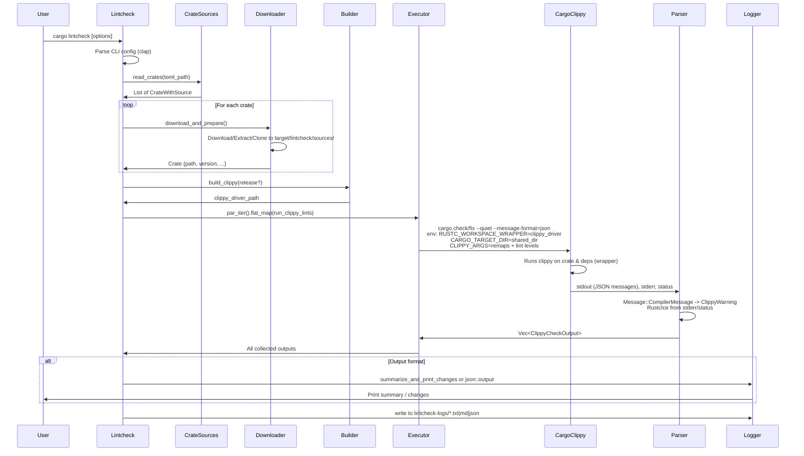
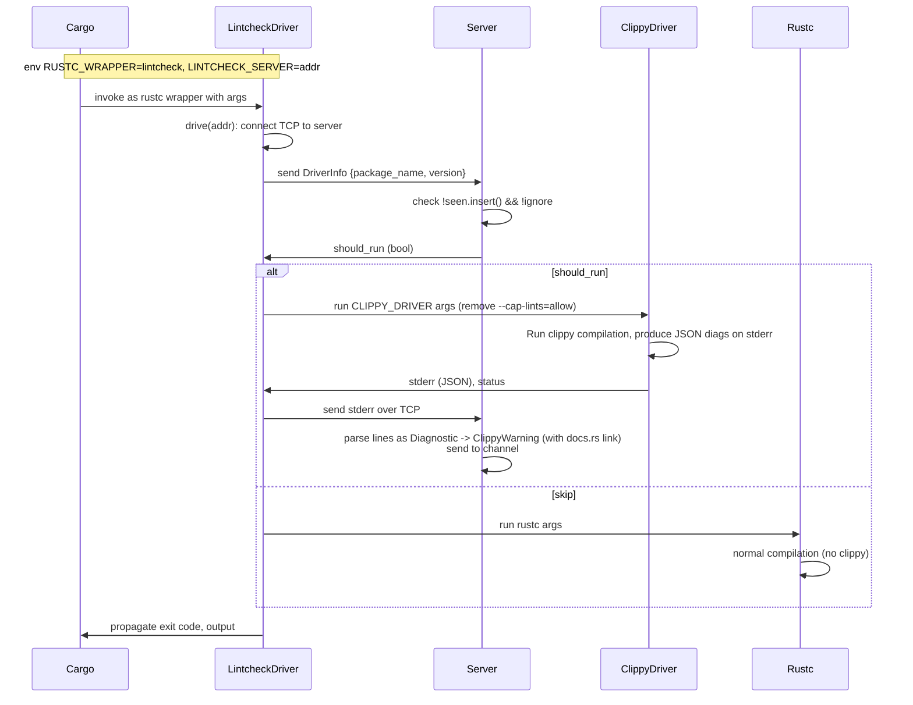

# High-Level Design of Lintcheck Workflow

## Overview

Lintcheck is a tool within the Rust Clippy project designed to execute Clippy on a curated selection of external Rust crates. Its primary purpose is to monitor the effects of modifications to Clippy's lints, helping to identify regressions, false positives, new lint triggers, and potential internal compiler errors (ICEs) by analyzing and comparing diagnostic outputs across different Clippy states or versions.

The workflow supports downloading crate sources from various origins (crates.io, Git repositories, or local paths) as defined in TOML configuration files. It runs `cargo clippy` or `cargo fix` in parallel, collects lint diagnostics from JSON-formatted compiler messages, and generates logs or summaries in multiple formats (text, Markdown, JSON). Advanced features include recursive linting of dependencies through a custom compiler wrapper and a coordinating server, performance profiling with `perf`, and utilities for diffing results or generating popular crate lists.

**Entry Point**: The `cargo lintcheck` binary, implemented in `lintcheck/src/main.rs`, which must be run from the Clippy repository root.

## Components

- **CLI Configuration (`lintcheck/src/config.rs`)**: Utilizes Clap for parsing command-line arguments. Key options include `--jobs` (parallelism), `--crates-toml` (source list file), `--fix` (run fixes and validate), `--recursive` (lint dependencies), `--perf` (benchmarking mode), output format, lint filters, and subcommands (`diff` for log comparison, `popular` for generating TOML from top crates).
  
- **Crate Source Management (`lintcheck/src/input.rs`)**: Parses TOML files (e.g., `lintcheck_crates.toml`) into `CrateWithSource` structures supporting crates.io (name+version), Git (URL+commit), or local paths. Handles downloading tarballs via `ureq`, extracting with `flate2`/`tar`, cloning Git repos, or copying local dirs to `target/lintcheck/sources/`. Removes conflicting `rust-toolchain` files and generates source links (e.g., to docs.rs or GitHub).

- **Main Orchestration (`lintcheck/src/main.rs`)**: Builds the local `clippy-driver` binary, loads and prepares crates, configures Rayon for parallel execution of lint runs, collects `ClippyCheckOutput` (warnings or ICEs), manages optional recursive server, and delegates to output handlers. Supports path remapping via environment variables to anonymize build paths in diagnostics.

- **Rustc Wrapper Driver (`lintcheck/src/driver.rs`)**: Activated in recursive mode as `RUSTC_WRAPPER`. Connects via TCP to the server, sends `DriverInfo` (crate name/version), receives decision on whether to proceed, runs `clippy-driver` (stripping cap-lints) if approved or falls back to `rustc`, and forwards stderr for processing.

- **Recursive Coordination Server (`lintcheck/src/recursive.rs`)**: A TCP server (bound to `localhost:0`) that processes driver connections in threads. Filters crates based on seen set and ignore list from TOML `[recursive]` section, parses JSON diagnostics from stderr into `ClippyWarning` instances (using docs.rs links), and channels results back to main loop.

- **Output and Analysis**:
  - `lintcheck/src/output.rs`: Structures like `ClippyWarning`, `RustcIce`, `ClippyCheckOutput`; functions for summarizing changes, detecting ICEs, and printing.
  - `lintcheck/src/json.rs`: Handles JSON output and diffing between log files (for subcommand `diff`).
  - `lintcheck/src/popular_crates.rs`: Fetches top crates from crates.io API to generate TOML files (subcommand `popular`).

- **Configuration Files**:
  - `lintcheck/lintcheck_crates.toml`: Main list of crates for full runs.
  - `lintcheck/ci_crates.toml`: Reduced set for CI efficiency.
  - `lintcheck/ci-config/clippy.toml`: Clippy-specific configuration for runs.
  - Generated logs in `lintcheck-logs/` (e.g., `{basename}_logs.{txt|md|json}`).

Dependencies include `cargo_metadata` for message parsing, `rayon` for parallelism, `crossbeam-channel` for server communication, `diff` for comparisons, and others for I/O and networking.

## Sequence Diagrams

### Main Workflow (Non-Recursive Mode)

### Recursive Dependency Linting (Server-Driver Interaction)

## Additional High-Level Design Aspects

- **Parallel Execution and Resource Management**: Employs Rayon for concurrent crate processing, with cycled `CARGO_TARGET_DIR` per thread to prevent conflicts. Shared directories optimize space; cleaned in perf mode.
  
- **Path Normalization and Privacy**: Applies `--remap-path-prefix` env vars to obscure local paths (e.g., replace thread-specific target dirs with `_*`, hide `CARGO_HOME`), ensuring consistent, anonymized diagnostics across runs.

- **Lint Invocation Control**: Configures Clippy via `CLIPPY_ARGS` (lint levels like `--force-warn=clippy::all`), caps lints to `allow` for continuation on errors. Supports all/nursery/pedantic/restriction groups or specific filters.

- **Error and ICE Detection**: Parses `cargo_metadata::Diagnostic` from JSON; detects ICEs via stderr patterns and non-zero exit codes. Continues processing despite failures but logs warnings.

- **Fix Mode Validation**: Executes `cargo fix`, scans stderr for failed rustfix applications, reports issues without collecting warnings.

- **Performance Profiling**: `--perf` wraps commands in `perf record` (instructions, call-graph), generates `perf.data` files per crate, limits to single thread.

- **Subcommand Workflows**:
  - `diff`: Loads two JSON logs, computes differences, outputs Markdown with truncation option, optional summary JSON.
  - `popular`: Queries crates.io API for top N downloads, generates TOML with crates.io sources.

- **CI Integration**: Uses `ci_crates.toml` for faster runs; `ci-config/clippy.toml` for tailored Clippy settings.

- **Robustness and Testing**: Retries failed downloads, handles large outputs, includes unit tests (e.g., sample run). Relies on local Clippy build for consistency.

- **Trade-offs**: Network/disk/CPU intensive for large sets; recursive mode adds overhead but enables dep coverage. Filtered ignores prevent timeouts on problematic crates.

This workflow integrates into Clippy's testing infrastructure, complementing UI/unit tests by validating on diverse real-world codebases, ensuring lint stability and evolution.