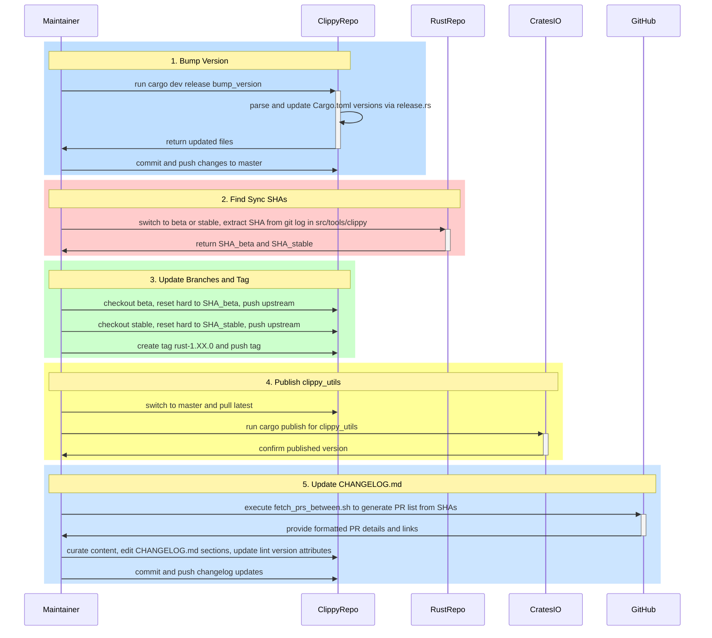

# High-Level Design of Workflow #8: Release Process (release-process)

## Overview

The release-process workflow manages the release cycle of Clippy, which is integrated into the Rust toolchain releases. It includes bumping internal crate versions, aligning Clippy's beta and stable branches with corresponding Rust branches by resetting to synced commits from the Rust repository, tagging stable releases, publishing the `clippy_utils` crate to crates.io, and updating the CHANGELOG.md with curated changes from merged PRs.

This workflow ensures version consistency, documentation accuracy, and timely availability of updates via rustup. It is primarily manual, guided by documentation, with automation for version bumping and PR fetching. Performed by Clippy team members around Rust release dates listed on the Rust Forge.

Inputs:
- New version string and release notes.
- Sync commit SHAs from Rust repo's src/tools/clippy.
- Merged PR data between previous and current sync commits.

Outputs:
- Updated Cargo.toml versions.
- Synced git branches (beta, stable) and tags (e.g., rust-1.80.0).
- Published `clippy_utils` on crates.io.
- Enhanced CHANGELOG.md with categorized changes, dates, and links.

Entry point: `cargo dev release` for version bump; manual git/gh commands otherwise.

## Components

- **Version Management (clippy_dev/src/release.rs and main.rs)**: Provides `bump_version` function to increment minor versions in key Cargo.toml files (e.g., clippy_lints, clippy_utils, root). CLI subcommand `cargo dev release bump_version` triggers this, followed by commit.

- **Branch and Tag Management**: Git operations to reset `beta` and `stable` branches to SHAs extracted from Rust repo's git log on src/tools/clippy/, and create annotated tags for stable.

- **PR Fetching Script (util/fetch_prs_between.sh)**: Analyzes git history for merge commits between SHAs, extracts PR numbers, skips no-changelog entries, fetches details via gh CLI, outputs formatted text with URLs and PR count link for changelog.

- **CHANGELOG Maintenance**: Manual curation of PR changelog entries into categories (New Lints, Moves and Deprecations, Enhancements, etc.), updating section headers, dates, commit ranges, and lint `#[clippy::version]` attributes.

- **Publishing Mechanism**: `cargo publish` for `clippy_utils` from master branch post-sync and release, requiring prior rustup PR merge for version alignment.

- **Documentation**:
  - `book/src/development/infrastructure/release.md`: Core guide for steps.
  - `book/src/development/infrastructure/changelog_update.md`: Changelog-specific instructions, including beta-accepted PRs.

- **External Integrations**: Rust repository for sync points, crates.io for publishing, GitHub for PR queries and labels (e.g., beta-accepted).

## Sequence Diagram

## Other High-Level Design Aspects

- **Coupling with Rust Releases**: Clippy's release is not independent; branches mirror Rust's via subtree merges in Rust repo. Sync workflow (#9) precedes release for API updates.

- **Manual Curation Points**: Changelog requires human judgment for relevance, wording, and categorization to avoid noise and ensure usefulness.

- **Access Requirements**: Team membership for pushes to rust-lang repos, gh auth for CLI, cargo login for publishing.

- **Validation Steps**: Run `cargo test` post-version bump to catch mismatches; verify tags on GitHub; check published crate version.

- **Potential Improvements**: Further automation via scripts for branch resets or changelog drafting, but current design prioritizes control and review.

- **Related Workflows**: Integrates with lint-development (#5), testing (#4), and sync-rustc (#9) for comprehensive release preparation.

This design reflects analysis of source code (clippy_dev, util, book), documentation, and project structure in rust-clippy repository.