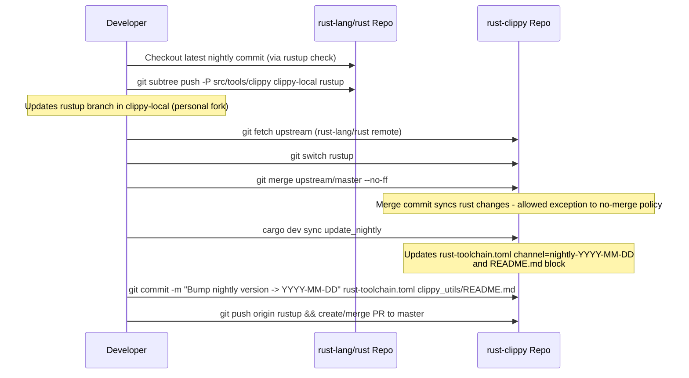
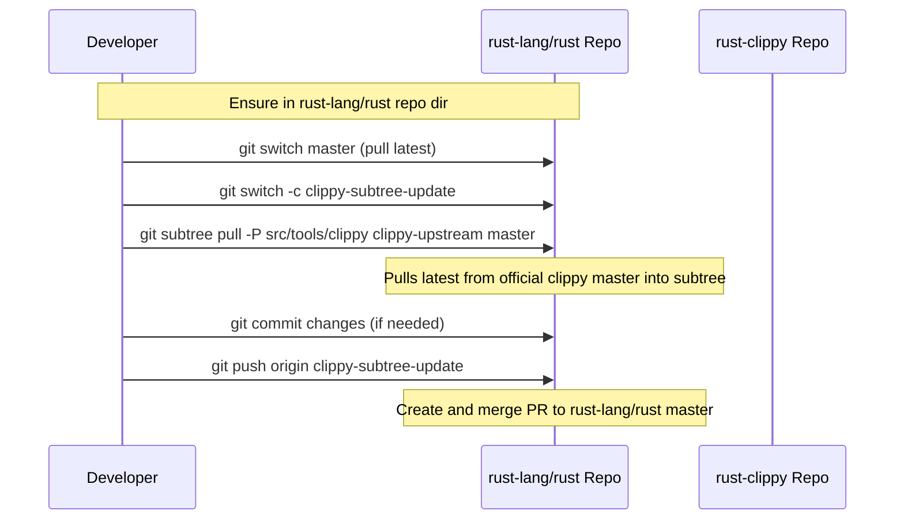

# Design of Workflow #9: sync-rustc

## Overview

The \"sync-rustc\" workflow is responsible for synchronizing Clippy's dependencies and code with updates to the Rust compiler internals. Clippy relies on unstable, private APIs from rustc, so it must track changes in the `rust-lang/rust` repository. To enable this, a mirrored copy of Clippy's source is maintained within `rust-lang/rust` at `src/tools/clippy` using git subtree. This allows compiler developers to adapt Clippy directly during rustc development.

The workflow is bi-directional:
- **From rust-lang/rust to Clippy**: Pull updates from rust's Clippy copy (including API adaptations) into the standalone Clippy repo, followed by bumping the nightly toolchain version.
- **From Clippy to rust-lang/rust**: Push standalone Clippy changes (new lints, fixes) into rust's subtree.

Syncs occur bi-weekly, starting after each Rust stable release, ensuring Clippy compatibility and availability of new features in nightly for ~2 weeks before beta. The process is largely manual, documented in `book/src/development/infrastructure/sync.md`, with automation limited to nightly updates via `clippy_dev`.

Input: Target rustc commit/version (nightly date).
Output: Updated codebases, vendored deps/patches, Cargo.toml adjustments, PRs in both repos.

## Components

### Repositories
- **rust-lang/rust**: Hosts the Clippy subtree (`src/tools/clippy`) for in-place modifications during compiler changes.
- **rust-lang/rust-clippy**: Standalone repo for Clippy development, testing, and releases.

### Tools and Commands
- **git & git-subtree**: Core for subtree management. Requires a patched `git-subtree` script to handle large repos (bug fix from [gitgitgadget PR](https://github.com/gitgitgadget/git/pull/493)).
- **cargo dev sync update_nightly**: Updates `rust-toolchain.toml` and `clippy_utils/README.md` with current nightly date.
- **FileUpdater (clippy_dev/src/utils.rs)**: Utility for safe, marker-bounded file edits (e.g., replacing regions between `# begin autogenerated nightly` and `# end`).

### Key Files and Modules
- `clippy_dev/src/sync.rs`: Entry point for nightly update; uses `chrono` for date formatting.
- `book/src/development/infrastructure/sync.md`: Step-by-step guide, including remote setup and caveats.
- `rust-toolchain.toml`: Pins Rust channel for building/testing Clippy.
- `Cargo.toml` (workspace and crates): Depend on rustc internals (via `rustc_private`); updated during sync for version locks.
- `clippy_utils/README.md`: Documents current supported nightly.

### Remotes Configuration
- In `rust-lang/rust` repo:
  - `clippy-local`: Points to personal Clippy fork (for pushing during sync).
  - `clippy-upstream`: Points to official `rust-lang/rust-clippy` master.
- In `rust-clippy` repo:
  - `upstream`: Points to `rust-lang/rust` (for fetching during sync).

## Sequence Diagrams

### Sync from rust-lang/rust to rust-clippy

### Sync from rust-clippy to rust-lang/rust

## Other High-Level Design Aspects

### Patching git-subtree
- Download patched script from [source](https://github.com/gitgitgadget/git/pull/493).
- Install to `/usr/lib/git-core/git-subtree` with proper perms.
- First `git subtree push`: Builds cache (full history scan); run `ulimit -s 60000` to increase stack limit.
- Debian users: Edit script shebang to `#!/bin/bash` (dash has recursion limit).

### Frequency and Cadence
- Bi-weekly, starting day of Rust stable release.
- Ensures no flooding of rust PR queue; allows 2-week window for features in nightly before beta.

### Caveats and Trade-offs
- **Manual Process**: Relies on developer following docs; error-prone without automation.
- **Merge Commits**: Exceptionally allowed in clippy PRs for sync (normally forbidden).
- **Remote Setup**: Requires personal forks for safe pushing; see `release.md#defining-remotes` for base setup.
- **Compatibility Lockstep**: Clippy pinned to specific nightly; syncs adapt to rustc API changes, potentially requiring lint updates.
- **Testing Integration**: Post-sync, run full tests (cargo test, lintcheck) to catch breakages.
- **Historical Issues**: Subtree syncs have caused problems (e.g., debug assertions in clippy_utils); design favors tight rustc integration over independence.

### Relation to Other Workflows
- Prerequisite for `release-process` (workflow #8): Sync before bumping versions/publishing.
- Complements `lint-development` (#5): New lints pushed via sync to rust.
- Ties into `build-source` (#3) via updated toolchain/deps.

This design balances deep rustc integration (enabling advanced lints) with maintainability, though subtree management adds overhead. Future proposals (e.g., roadmap-2021.md) discuss easier sync alternatives.

