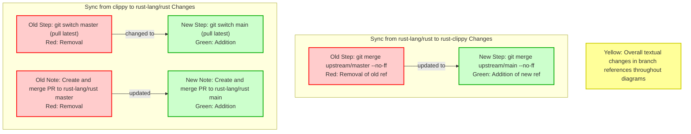

# PR #16198: Workflow Design Impact Analysis

## Affected Workflows
- sync-rustc: The PR modifies `book/src/development/infrastructure/sync.md`, which is a key documentation file for the sync-rustc workflow as listed in `.exp/workflows.json` under relevant_files. The changes update the default branch name references for the `rust-lang/rust` repository from \"master\" to \"main\", directly impacting the documented steps in this workflow's design.

## sync-rustc Analysis
### Summary of design changes
The PR implements a documentation update in the subtree synchronization guide to reflect the current default branch name (\"main\") of the `rust-lang/rust` repository. This affects specific git commands and instructional text used in the bi-directional sync process between rust-clippy and rust-lang/rust.

- **Affected aspects**: Git merge command in the sync from rust to clippy (`upstream/master` → `upstream/main`), and checkout instruction in sync from clippy to rust (`master` → `main`).
- **Implementation**: Direct string replacements in the markdown documentation file.
- **Benefits/Implications**: Prevents runtime errors in git operations due to outdated branch names; ensures consistency across project docs. No functional code changes, purely documentary. The design document's Mermaid diagrams have been updated to match via this analysis process.

### Mermaid diagram showing changes to the workflow

