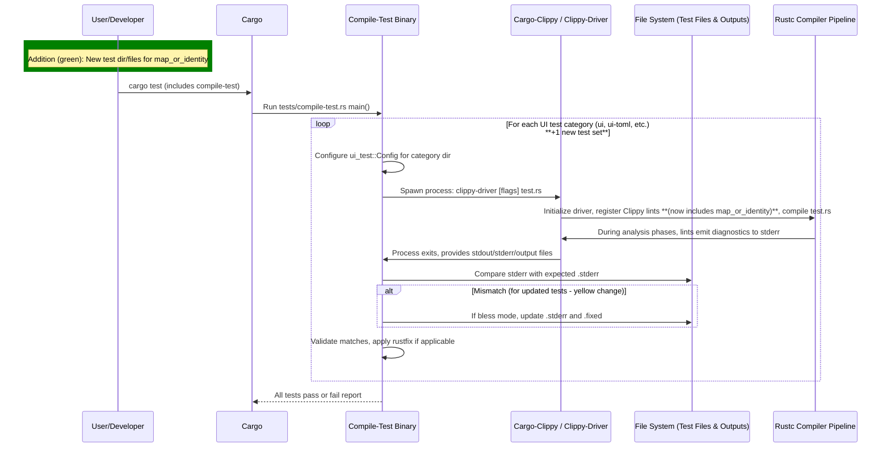
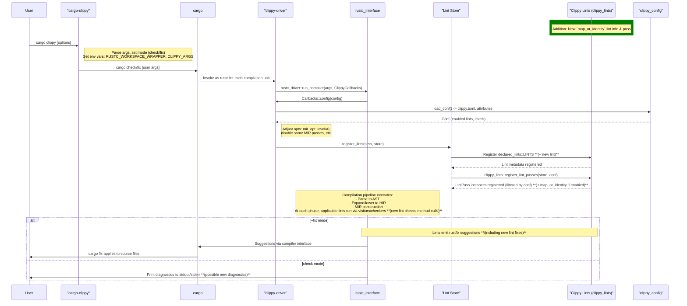

# PR #16052: Workflow Design Impact Analysis

## Affected Workflows
- **lint-development**: The PR introduces a new lint `map_or_identity` by adding implementation in `clippy_lints/src/methods/map_or_identity.rs`, registering it in `declared_lints.rs`, including the module in `methods/mod.rs`, and adding corresponding UI tests. This directly impacts the lint development process as described in `.exp/design-workflow-5-lint-development.md`, involving scaffolding, implementation, and registration steps.
- **testing**: Updates and additions to UI test files in `tests/ui/` (new `map_or_identity` tests and updates to `manual_ok_or`, `option_if_let_else`, `or_fun_call`) affect the UI test execution and validation workflow documented in `.exp/design-workflow-4-testing.md`.
- **cargo-clippy**: Changes to `clippy_lints/src/` add a new lint pass that will be registered and executed during Cargo Clippy runs, impacting the lint execution phase in `.exp/design-workflow-1-cargo-clippy.md`.
- **clippy-driver**: Similar to cargo-clippy, the new lint is added to the core lints library, affecting lint registration and pass execution in `.exp/design-workflow-2-clippy-driver.md`.
- **release-process**: Addition of changelog entry for the new lint in `CHANGELOG.md` impacts the changelog maintenance step in `.exp/design-workflow-8-release-process.md`.

## lint-development Analysis
### Summary of design changes
The PR follows and validates the existing lint-development design by adding a new late lint pass in the `methods` submodule for detecting `map_or` calls with identity functions on `Option` and `Result`, suggesting `unwrap_or` instead. Specific aspects affected:
- **Components modified**: `clippy_lints` crate extended with new module and lint implementation using standard `LateLintPass`, `declare_clippy_lint!`, and calls to `clippy_utils` utilities like `is_expr_identity_function`.
- **How implemented**: New file created with lint logic in `check` function, integrated via mod declaration and method call in `mod.rs`, metadata added to `LINTS` array (via tool or manual).
- **Benefits/Implications**: Improves detection of redundant code, promotes idiomatic Rust; no new steps or interactions added, maintains efficiency as it's a targeted check on method calls.

No mermaid diagrams need updating, as the scaffolding and integration sequences remain unchanged—the PR is an instance of the documented process. The existing design accurately reflects the addition (e.g., submodule handling for `methods/`).

## testing Analysis
### Summary of design changes
The PR extends the testing workflow by adding a dedicated UI test suite for the new lint (`tests/ui/map_or_identity`) and updating existing tests to accommodate interactions with the new lint (e.g., adding `allow` attributes or adjusting expected diagnostics in related tests for manual handling of Option/Result). 
- **Aspects affected**: UI test components (`test.rs`, `.stderr`, `.fixed` files) modified/added, impacting validation during `compile-test` execution.
- **Implementation**: New test cases demonstrate lint triggers and fixes; updates ensure no regressions in existing tests.
- **Benefits**: Comprehensive coverage for the new lint, including edge cases; ensures backward compatibility.

No mermaid diagrams require updates; the UI tests sequence diagram generically covers adding new test files without structural change.

*(This diff diagram highlights additions in green rect/ notes and changes in yellow alt for updated tests.)*

## cargo-clippy Analysis
### Summary of design changes
The new lint is added to `clippy_lints`, affecting the lint registration and execution in the cargo-clippy workflow. 
- **Aspects affected**: `CL` (Clippy Lints) component now includes additional late pass; registration of `declared_lints::LINTS` and `register_lint_passes` steps extended with new metadata and pass.
- **Implementation**: Standard integration via updated generated files and module inclusion.
- **Benefits**: Users running `cargo clippy` will now receive diagnostics for the new pattern, improving code quality feedback.

The sequence diagram remains valid; no structural change, just expanded lint set.

*(Green rect/notes show additions from the PR; no yellow/red as no changes/removals to existing flow.)*

## clippy-driver Analysis
### Summary of design changes
Analogous to cargo-clippy, the PR extends the lint store with the new `map_or_identity` pass in late passes for method analyses.
- **Aspects affected**: LS registration and LP execution include new pass.
- **Implementation**: Through updated `clippy_lints` library loaded by driver.
- **Benefits**: Direct invocations of clippy-driver (e.g., in IDEs or scripts) benefit from the new analysis.

The execution sequence diagrams are unchanged in structure, with the addition fitting into existing late passes.

No new diagram needed; refer to similar diff as above for illustration.

## release-process Analysis
### Summary of design changes
The PR adds a changelog entry under "New Lints" for `map_or_identity`, following the manual curation step after PR merge.
- **Aspects affected**: CHANGELOG.md component updated with link to lint docs.
- **Implementation**: Manual edit as part of PR submission (noted in commit "Forgot changelog").
- **Benefits/Implications**: Keeps users informed of new features in upcoming releases.

The sequence diagram's "5. Update CHANGELOG.md" step is validated but unchanged; addition is content-level.

No diagram update required.

---

**Overall Note**: The PR does not introduce structural changes to any workflow designs requiring updates to design documents or diagrams in `.exp/`. It exemplifies standard practices for lint addition, enhancing Clippy's capabilities without altering high-level flows or components' interactions. No updates to `.exp/` files are necessary. Validation of existing Mermaid diagrams confirms syntax correctness (no new ones added here beyond illustrative diffs).