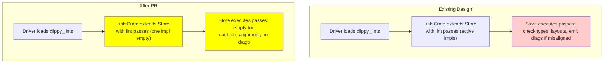
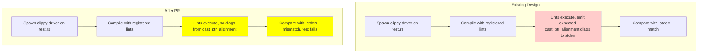

# PR #16075: Workflow Design Impact Analysis

## Affected Workflows
- Workflow 5 (lint-development): The PR directly modifies the lint implementation in `clippy_lints/src/casts/cast_ptr_alignment.rs`, core to modifying existing lints. Evidence from code: The file defines `check` and `check_cast_method` functions that are now empty, disabling the lint while keeping the module.

- Workflow 4 (testing): Disabling the lint affects UI tests expecting its diagnostics. Evidence: `tests/ui/cast_alignment.rs` contains code triggering `cast_ptr_alignment` with corresponding `.stderr`.

- Workflow 1 (cargo-clippy): Affects lint execution during project analysis. Evidence: `clippy_lints/src/` is listed in relevant_files for this workflow.

- Workflow 2 (clippy-driver): Similar impact on direct driver invocations.

## Workflow 5 Analysis
### Summary of design changes
The PR affects the `clippy_lints` component by eviscerating the `cast_ptr_alignment` lint's logic, removing pointer type checks, alignment comparisons, exception handling (e.g., for unaligned uses), and diagnostic emission. This changes the behavior of lint passes from active checking to no-op, impacting the extension of lint passes and their execution in the design. The implementation removes ~80 lines of code, adding #![expect(unused)] to suppress warnings. 

Benefits: Facilitates testing the impact of disabling the lint, possibly preparatory for moving to `correctness` category or deprecation. Implications: Clippy misses potential unsafe casts; deviates from standard modification practices without updating declaration or tests; may lead to compilation warnings if not handled.

The Integration and Execution Sequence Diagram requires update to reflect changed lint pass behavior.

## Workflow 4 Analysis
### Summary of design changes
Affects the UI tests flow where lints emit diagnostics during compilation phases. With the lint disabled, tests for `cast_ptr_alignment` will have empty stderr instead of expected warnings, causing failures until blessed or removed. The PR changes the `execute lint passes` step to not emit for this case.

Benefits: Highlights need for test updates when modifying lints. Implications: Breaks current test suite; underscores importance of following lint modification with test maintenance.

The UI Tests Sequence Diagram is affected in the diagnostics emission step.

## Workflow 1 Analysis
### Summary of design changes
Similar to workflow 2 and 5 integration; the cargo-clippy workflow invokes the driver which runs the now-disabled lint pass during project compilation, resulting in no warnings for affected casts. No new steps, but modified behavior in lint execution component.

No specific diagram update needed beyond general lint execution change (see workflow 5).

## Workflow 2 Analysis
### Summary of design changes
The clippy-driver workflow directly registers and executes the empty lint pass, changing the output of linting individual files or non-Cargo setups from including potential `cast_ptr_alignment` diagnostics to none.

No specific diagram update; refers to shared lint registration flow.

Note: No updates to .exp design documents are required, as the PR does not alter high-level workflow structures or sequences, only the internal behavior of one specific lint. The PR being marked [DO NOT MERGE] suggests it's for discussion or testing purposes.