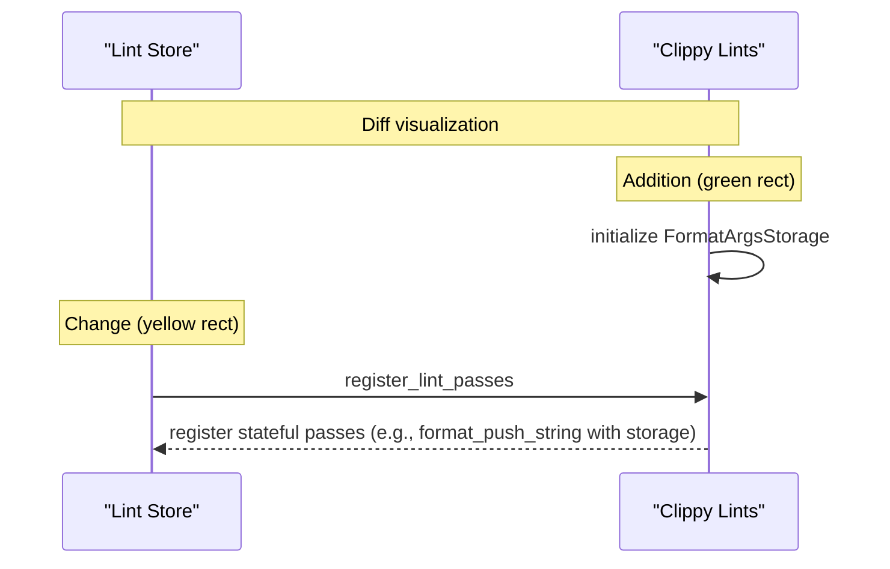
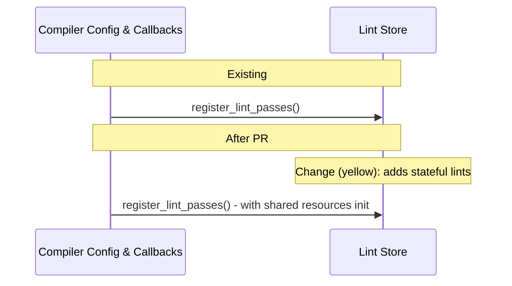
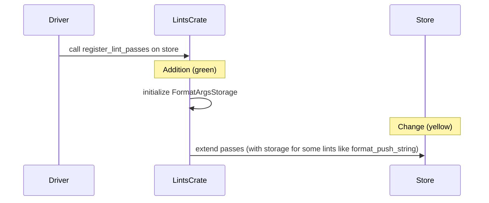

# PR #16093: Workflow Design Impact Analysis

## Affected Workflows
- **cargo-clippy** (Workflow 1): The PR changes code in `clippy_lints/src/` (lint implementation and registration), which is executed during Cargo project analysis via the clippy-driver wrapper. This impacts the diagnostics produced in the workflow's output.

- **clippy-driver** (Workflow 2): Direct changes to lint passes registered by the driver, affecting individual file or non-Cargo linting.

- **testing** (Workflow 4): Updates to multiple UI test files in `tests/ui/` for the `format_push_string` lint, including new tests for suggestion behavior under various configurations (no_std, unfixable cases) and updated expected outputs (`.stderr`, `.fixed`).

- **lint-development** (Workflow 5): The PR is a direct instance of lint development, modifying an existing lint's logic to add suggestion support, updating manual registration in `lib.rs` to use stateful pass construction, and maintaining corresponding UI tests.

## cargo-clippy Analysis
### Summary of design changes
Specific aspects affected: The registration and execution of lint passes in the compilation pipeline. The PR updates the constructor for `FormatPushString` pass to include `FormatArgsStorage`, enabling advanced detection of `format!` macro calls for generating targeted suggestions. This is implemented within `register_lint_passes` by cloning the shared storage into the pass. Potential benefits: Improved lint accuracy and user-friendly fixes, reducing unnecessary String allocations in formatted string concatenation. Implications: Enhanced diagnostic quality in project-wide linting runs.

The design diagram's registration step has been updated to note internal resource initialization and stateful pass creation.

 (Green: new internal step; Yellow: modified pass registration to support state.)

## clippy-driver Analysis
### Summary of design changes
Similar to cargo-clippy, the PR affects the lint pass registration in the driver's compiler callbacks. The updated pass can now provide suggestions during direct compilations. Implemented by the same code changes in clippy_lints. Benefits: Consistent improvements across invocation methods. The design diagram updated accordingly.

 (Yellow: updated description to include resource handling.)

## testing Analysis
### Summary of design changes
The PR updates 11 test files to match the new diagnostic outputs, including addition of `.fixed` files for testing auto-fix applicability and new test cases for edge cases (e.g., no_std_unfixable). This validates the lint's new suggestion logic without changing the UI test execution flow or components. Implemented by updating expected `.stderr` with new messages, labels, notes, and fix results. Benefits: Ensures regression-free enhancements and full coverage of new features. No mermaid diagram updates needed, as the sequence remains the same.

## lint-development Analysis
### Summary of design changes
The PR modifies the documented design by exemplifying and prompting documentation of stateful lint passes using shared `FormatArgsStorage` for macro analysis. Specific aspects: Lint implementation now includes state in pass struct for efficiency, registration manually passes cloned storage. New detection logic spans nested expressions via recursive search. Suggestions use `span_suggestion_verbose` with `Applicability::MaybeIncorrect` and dynamic paths via `std_or_core`. The design doc has been updated with a new bullet in "Lint Implementation Details" and enhanced integration diagram to show resource preparation and stateful extension. Benefits: Enables complex analysis patterns for lints, improves suggestion completeness for `format_push_string`. Implications: Developers can adopt this pattern for other macro-heavy lints.

Updated mermaid diagram in doc shows additions/changes; diff visualization:

 (Green: new resource init step; Yellow: modified extension to include state passing.)

The PR does not affect other workflows' designs significantly.