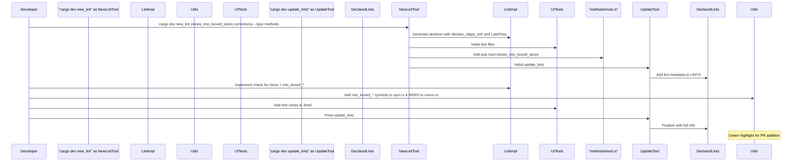

# PR #16095: Workflow Design Impact Analysis

## Affected Workflows
- **Workflow 5: lint-development**: The PR adds a new lint implementation in `clippy_lints/src/methods/clones_into_boxed_slices.rs`, updates `methods/mod.rs` and generated `declared_lints.rs`, extends `clippy_utils` with new entries in `sym.rs` and `msrvs.rs`, and adds UI tests. This directly utilizes and slightly extends the lint-development workflow as described in workflows.json and design doc.

- **Workflow 4: testing**: New UI test files in `tests/ui/clones_into_boxed_slices.{rs,stderr,fixed}` and updates to existing tests (`crashes/ice-3969.rs`, `unnecessary_box_returns.rs`). Impacts the UI testing component.

- **Workflow 1: cargo-clippy**: Changes to `clippy_lints/src/` and `clippy_utils/src/` integrate the new lint into the analysis performed during `cargo clippy` runs.

- **Workflow 2: clippy-driver**: Similar integration of new lint and utils into the compiler driver pipeline.

- **Workflow 8: release-process**: Update to `CHANGELOG.md` adding the new lint entry, consistent with release note preparation.

## Workflow 5 Analysis (lint-development)
### Summary of design changes
The PR implements the `clones_into_boxed_slices` lint, which detects patterns like `vec.clone().into_boxed_slice()` and suggests `Box::from(vec)` for efficiency. It follows the scaffolding process but highlights the need for manual extensions to shared utilities:

- **Addition to clippy_utils component**: New symbols (`into_boxed_slice`, `into_boxed_str`, etc.) in `sym.rs` for matching specific methods, and MSRV entry in `msrvs.rs` setting min version 1.7.0. This enables symbol-based checks and version gating without breaking older Rust versions.

- **Standard integration**: Lint declared with `declare_clippy_lint!`, implemented as LateLintPass checking method chains, using utils for type analysis and suggestions. Tests added for verification.

- **Implications**: Enhances lint expressiveness for std lib methods; design now better documents utility extensions as part of implementation step. Updated design doc text and diagram to reflect this (additions in green below for illustration).

The updated design incorporates these extensions explicitly in the scaffolding sequence, ensuring future developers account for them.

(Note: The above is an instance-specific sequence for this PR, showing green-highlighted addition in Utils. Original design sequence updated in .exp/design-workflow-5-lint-development.md to generalize this step.)

## Workflow 4 Analysis (testing)
### Summary of design changes
New lint requires new UI tests to validate diagnostics and fixes, added as standard .rs/.stderr/.fixed files. Updates to existing tests ensure no regressions or unwanted triggers from new lint logic. 

- Specific: New dir for lint-specific tests; fixes in crashes and other to bless updated outputs.

- No changes to compile-test execution, ui_test config, or dogfooding (though new lint will be dogfooded automatically).

- Benefits: Verifies lint accuracy, fix applicability, and stability.

No mermaid diagrams need updating; uses existing UI tests flow.

## Workflow 1 Analysis (cargo-clippy)
### Summary of design changes
New lint added to `clippy_lints` crate, registered via `declared_lints::LINTS` in driver, executed during compilation phases. Utils extension supports lint but doesn't alter wrapper logic, env setup, or Cargo invocation.

- How implemented: Standard lint registration in driver callbacks.

- Implications: `cargo clippy` now includes this check for all targets, improving coverage for boxed slice patterns.

No changes to sequence diagram; additional lint pass is implicit in Store->>Compiler execute lints.

## Workflow 2 Analysis (clippy-driver)
### Summary of design changes
Similar to workflow 1; new LateLintPass added to late passes extension in LintStore during driver init. Changes transparent to direct driver invocations.

No design alterations.

## Workflow 8 Analysis (release-process)
### Summary of design changes
Added changelog entry: "new lint: [`clones_into_boxed_slices`]". This is a routine update during lint addition, ahead of release.

No changes to release tool or process; manual but conventional.

