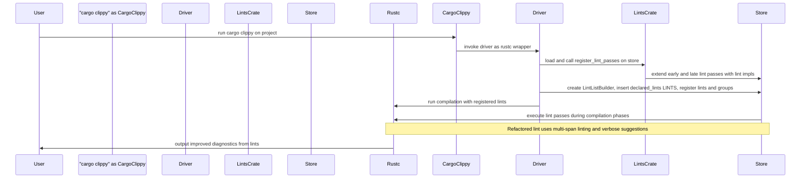

# PR #16120: Workflow Design Impact Analysis

## Affected Workflows
- **Workflow 1 (cargo-clippy)**: The PR modifies the implementation of the `missing_asserts_for_indexing` lint in `clippy_lints/src/missing_asserts_for_indexing.rs`, which is executed as part of the lint passes during `cargo clippy` runs. This affects the diagnostic output generated by the workflow. Evidence: Changed file listed in relevant_files for this workflow; overhaul of diagnostics changes the format of emitted messages. [PR #16120](https://github.com/rust-lang/rust-clippy/pull/16120)
- **Workflow 2 (clippy-driver)**: Similar to workflow 1, the refactored lint pass is registered and run when using the clippy-driver directly, impacting the diagnostics output.
- **Workflow 4 (testing)**: Updates expected output files (`tests/ui/missing_asserts_for_indexing.stderr` and `tests/ui/missing_asserts_for_indexing_unfixable.stderr`) to match the new diagnostic format from the refactored lint. Evidence: Changed test files in `tests/ui/`.
- **Workflow 5 (lint-development)**: The PR is an example of modifying an existing lint, refactoring its diagnostic reporting logic using advanced rustc_lint APIs. Evidence: Changes in `clippy_lints/src/` and corresponding UI tests.

## Workflow 1 Analysis
### Summary of design changes
The PR refactors the diagnostic reporting in the `missing_asserts_for_indexing` LateLintPass:
- Changes `span_lint_and_then` to use a `Vec` for multi-span coverage of all index expressions, allowing a single lint emission highlighting all relevant locations.
- Replaces `span_suggestion` with `span_suggestion_verbose` for suggestions, computing `Applicability` dynamically using `snippet_with_applicability` to handle cases where snippet replacement may not be safe.
- Uses `note_once` to emit the general advice only once, instead of repeating it and per-span notes.
- Minor cleanups like passing `map` by value and removing redundant methods.

These changes improve the quality of diagnostics output by the workflow: cleaner output with less redundancy, more accurate fix suggestions, and better spanning of issues. The high-level design (loading lints, registering passes, executing during compilation, outputting diagnostics) remains unchanged; this is an internal enhancement to one lint's implementation.

**Affected diagram**: Integration sequence diagram in `.exp/design-workflow-1-cargo-clippy.md`. The step "Compiler->>User: output diagnostics from lints" now produces improved diagnostics for this specific lint, but no structural change.

No updates to the Mermaid diagram are required, as the sequence and components are unaffected. However, for illustration, a diff version could highlight the output step:

(Note: This is illustrative; original diagram unchanged.)

### Potential benefits or implications
- Benefits: Less verbose output, potentially more applicable fixes, better user experience.
- Implications: Tests and users see updated diagnostic format; no impact on other lints or workflow correctness.

## Workflow 2 Analysis
### Summary of design changes
Analogous to workflow 1, the refactor affects diagnostic output when invoking clippy-driver directly. The changes to lint pass reporting enhance the quality of emitted diagnostics without altering the driver initialization, lint registration, or compilation pipeline sequence.

**Affected diagram**: Diagrams in `.exp/design-workflow-2-clippy-driver.md` (driver invocation and pipeline). No structural changes; improvement internal to lint execution.

No Mermaid updates needed.

### Potential benefits or implications
Same as workflow 1; direct driver users benefit from better diagnostics for this lint.

## Workflow 4 Analysis
### Summary of design changes
The PR updates the expected `.stderr` files for UI tests of the lint to reflect the new diagnostic format (multi-span underlines, consolidated notes, verbose suggestions). This ensures the testing workflow continues to correctly validate the lint's behavior post-refactor. The test execution sequence (spawn driver, compile test.rs, compare stderr) remains unchanged; only test data is adjusted.

**Affected diagram**: UI Tests sequence diagram in `.exp/design-workflow-4-testing.md`, specifically the "Compare stderr with expected .stderr" step now matches updated expectations for improved diagnostics.

No updates to Mermaid required.

### Potential benefits or implications
- Benefits: Tests accurately capture the new, improved diagnostic output.
- Implications: When blessing tests, the new format is the standard for this lint.

## Workflow 5 Analysis
### Summary of design changes
As a modification to an existing lint implementation, the PR demonstrates evolving lint code to use more advanced diagnostic APIs:
- Multi-span lint emission for comprehensive issue coverage.
- Dynamic applicability computation for suggestions.
- Efficient note emission with `note_once`.
This aligns with "Lint Implementation Details" in the design doc, enhancing diagnostic capabilities without changing scaffolding, update_lints generation, or integration sequences.

**Affected diagram**: Integration and Execution sequence diagram in `.exp/design-workflow-5-lint-development.md`. The "execute lint passes" and "output diagnostics" steps benefit from better implementation practices, but no sequence change.

No Mermaid updates needed.

### Potential benefits or implications
- Benefits: Serves as example for future lint development; improves this lint's effectiveness.
- Implications: Encourages adoption of these APIs in other lints for consistency.