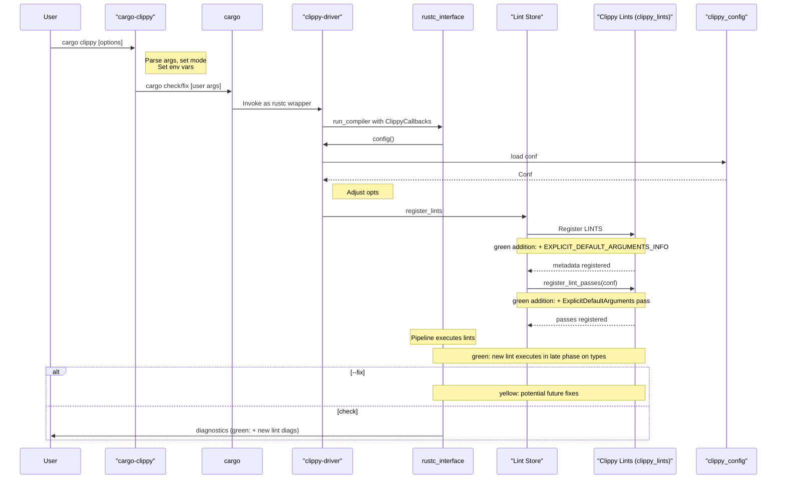
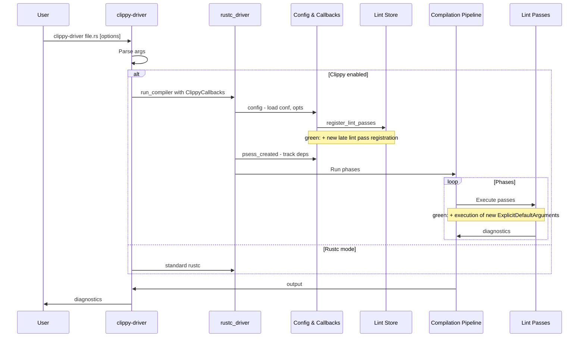
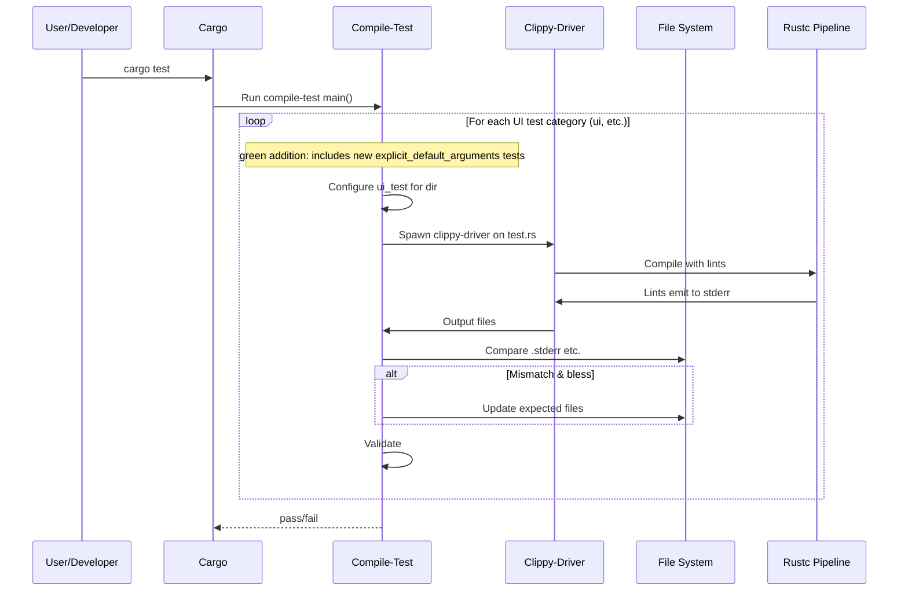
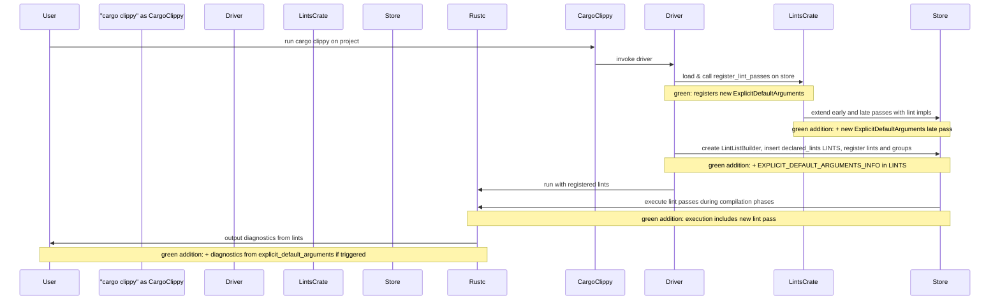
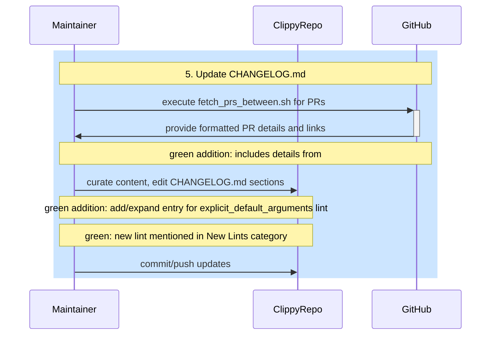

# PR #16123: Workflow Design Impact Analysis

## Affected Workflows
- **cargo-clippy**: The PR adds a new lint to `clippy_lints/src/`, which is a relevant file for this workflow. The new lint will be executed during `cargo clippy` runs, potentially emitting new diagnostics for projects using type aliases with explicit default generic arguments. Evidence: Changed files include `clippy_lints/src/*`.

- **clippy-driver**: Similar to `cargo-clippy`, the new LateLintPass is registered and will run during the compiler pipeline in `clippy-driver` invocations. Evidence: `clippy_lints/src/` is relevant, and registration updates in `lib.rs`.

- **testing**: New UI test files added in `tests/ui/explicit_default_arguments*`, which will be processed by the `compile-test` binary in the UI tests loop. Evidence: Changed files in `tests/ui/`.

- **lint-development**: Primary workflow impacted; the PR implements and integrates a new lint `explicit_default_arguments`, including module creation, declaration, registration in `declared_lints.rs` and `lib.rs`, and UI tests. Evidence: Matches workflow description and relevant files `clippy_lints/src/`, `tests/ui/`, `declared_lints.rs` updated.

- **release-process**: CHANGELOG.md updated with a new entry and link for the lint. Evidence: Changed `CHANGELOG.md`, relevant file for changelog updates during releases.

## cargo-clippy Analysis
### Summary of design changes
No structural changes to components, sequences, or flows. The PR extends the lint set by adding metadata to `declared_lints::LINTS` and a registration call in `register_lint_passes`, integrating the new style lint into existing registration and execution paths. The lint checks for redundant explicit default generic arguments in type alias usages by recursively walking types in HIR items (fns, impls, structs, etc.) using paired Ty and hir::Ty analysis.

How implemented: New `explicit_default_arguments.rs` with `LateLintPass` impl, custom `walk_ty_recursive` function handling various type kinds (Adt, FnPtr, Dynamic, Projection, Opaque, Tuple, etc.), matching generic args to alias defaults.

Benefits: Encourages concise code by linting e.g., `Result<()>` when `type Result<T=()>` has default, reducing clutter. Implications: Minor perf impact from type walking, new lint available in style category.

Mermaid diagrams needing update: The sequence diagram highlights the registration steps affected by additions (no removal/change).

## clippy-driver Analysis
### Summary of design changes
Similar to cargo-clippy; no design alterations. The new lint is added as a LateLintPass in the registration flow, extending the late passes executed during type checking and MIR phases. The custom type walker enables deep analysis of generic args in complex types (trait objects, projections, GATs in impl traits per recent commit).

Benefits: Enables standalone or IDE use of the new lint for direct file linting. Implications: Same as above, integrated into driver for non-Cargo setups.

Mermaid diagrams needing update: Main execution and lint execution flows extended with new pass.

## testing Analysis
### Summary of design changes
No changes to design; PR adds new test cases ( .rs, .stderr, .fixed, .stdout ) in `tests/ui/explicit_default_arguments` to verify lint triggers, messages, spans, and fixes across various item kinds (fns, structs, impls, etc.). These are processed in the UI tests category loop by `compile-test.rs` using ui_test framework, comparing outputs and potentially blessing.

How implemented: Test files simulate code with explicit default args in type aliases, expected outputs from lint emissions.

Benefits: Ensures the new lint's correctness, covers edge cases like recursive types, GATs, trait objects (with noted limitations). Implications: Expanded test suite, must pass `cargo test` before merge.

Mermaid diagrams needing update: UI tests sequence diagram's loop includes new tests.

## lint-development Analysis
### Summary of design changes
No fundamental changes to the workflow design or automation tools (e.g., `cargo dev new_lint`, `update_lints`). The PR manually adds the lint module, declaration via `declare_clippy_lint!`, UI test dir, updates to `lib.rs` (mod and register call), and `declared_lints.rs` (LINTS entry), following the integration pattern. The lint's recursive type walker is a self-contained impl in the pass, using existing `clippy_utils` and rustc APIs, without new utils or macros.

How implemented: `check_item` collects Ty/hir::Ty pairs from items/generics/fn sigs/impl items/trait items, walks recursively matching kinds, checks alias generics for explicit defaults matching resolved.

Benefits: Streamlines lint development for type-related analyses; new lint promotes idiomatic use of type alias defaults. Implications: As draft, needs `cargo dev update_lints` run, full tests, fmt; limitation on bounds in trait objects/impl types noted.

Mermaid diagrams needing update: Integration sequence extended with new lint; scaffolding used manually but diagram shows tool flow (no change needed as optional).

## release-process Analysis
### Summary of design changes
No changes to the release steps or tools. The PR proactively adds a changelog entry `changelog: [`explicit_default_arguments`]: TODO` and link in the lints list, which will be curated/expanded during the "Update CHANGELOG.md" step using `fetch_prs_between.sh` and manual editing for categories like New Lints.

How implemented: Minimal placeholder in CHANGELOG.md for future release notes.

Benefits: Prepares documentation for the new lint's introduction. Implications: Will be included in next release changelog after completion.

Mermaid diagrams needing update: The sequence diagram's changelog update step now incorporates this PR's contribution.

