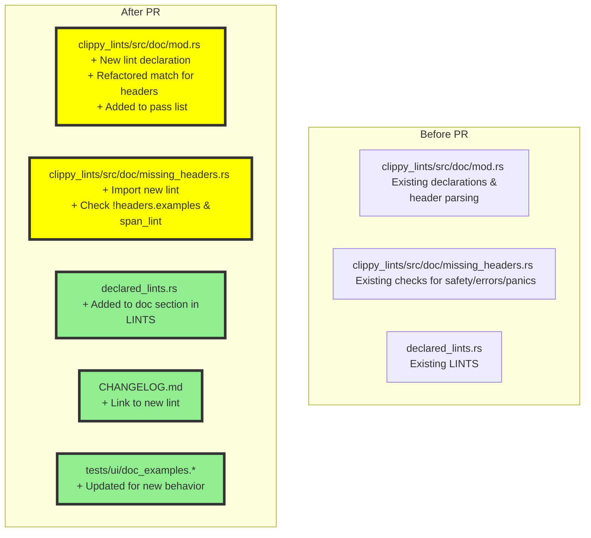
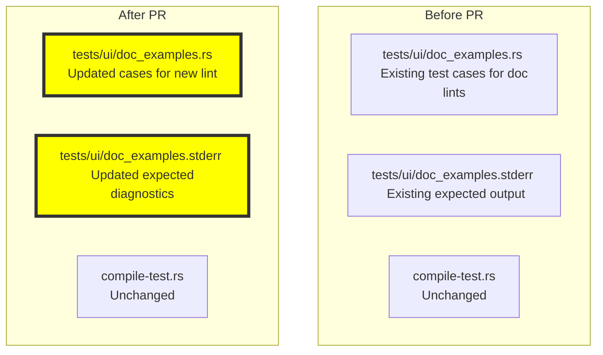
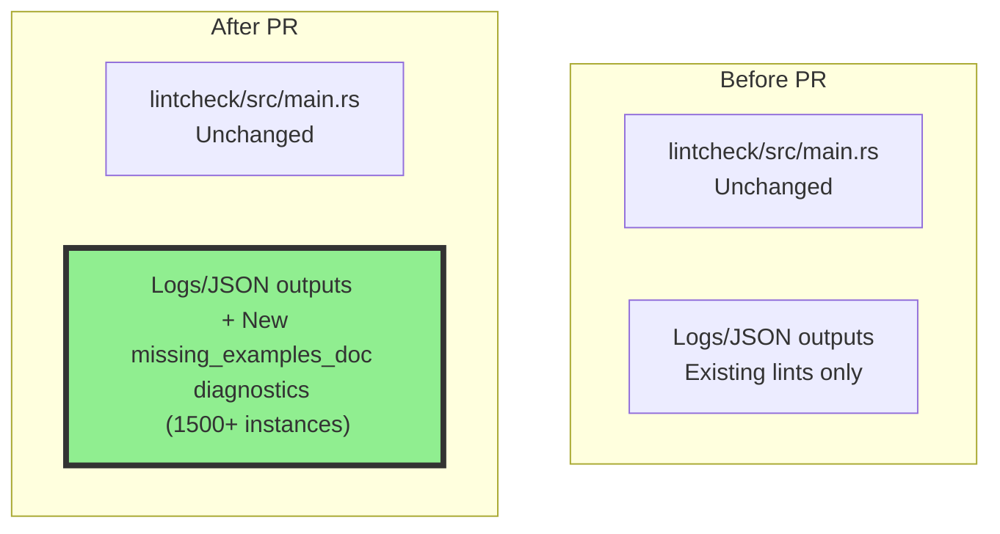

# PR #16143: Workflow Design Impact Analysis

## Affected Workflows
- **lint-development** (Workflow 5): The PR introduces a new lint `missing_examples_doc` focused on ensuring public functions have an `# Examples` header in their documentation comments. Changes include modifications to `clippy_lints/src/doc/mod.rs` and `clippy_lints/src/doc/missing_headers.rs` for lint logic and declaration, update to generated `declared_lints.rs`, addition to CHANGELOG.md, and updates to UI test files. These align directly with the lint-development workflow's components for implementing, registering, documenting, and testing new lints.
- **testing** (Workflow 4): Updates to `tests/ui/doc_examples.rs` and corresponding `.stderr` file to validate the new lint and refactored doc header detection. This impacts the UI tests component of the testing workflow.
- **lintcheck** (Workflow 6): The addition of the new lint affects lintcheck runs by introducing new diagnostic outputs across external crates, with the PR noting over 1500 new instances. This impacts the output and analysis phase of the lintcheck workflow, potentially requiring group adjustments.

## lint-development Analysis (Workflow 5)

### Summary of design changes
The PR extends the `Documentation` lint pass (in `clippy_lints/src/doc/`) by adding support for detecting missing `# Examples` headers. Specific changes:
- Added new `declare_clippy_lint!` for `MISSING_EXAMPLES_DOC` in `mod.rs` (consistent with other doc lints).
- Extended `DocHeaders` struct with `examples: bool`.
- Refactored header detection in `check_doc` from multiple or-assignments to a match expression for cleaner code.
- Added lint emission logic in `missing_headers.rs`'s `check` function if `!headers.examples`.
- The PR implements these via manual edits to existing module files rather than scaffolding a new lint file, demonstrating flexibility in the workflow for related lints.

This does not alter the high-level scaffolding or integration sequences but adds a new rule to the existing doc lint group. Benefits: Aligns with Rust API Guidelines for examples in docs, improves code maintainability via refactor. Implications: High trigger rate may warrant category discussion (code shows `restriction`, description suggests `pedantic`).

No updates needed to existing Mermaid diagrams, as flows unchanged. Below is a diff visualization of affected components:

## testing Analysis (Workflow 4)

### Summary of design changes
The PR updates the `doc_examples` UI test to incorporate diagnostics from the new lint and adjustments from the header refactor. This maintains the correctness of the UI test suite, which verifies lint outputs against expected `.stderr`. No changes to test execution flow, compile-test binary, or other components. Benefits: Ensures the new lint is properly tested alongside related doc lints. Implications: None significant.

Diff visualization of affected components:

## lintcheck Analysis (Workflow 6)

### Summary of design changes
No direct code modifications to lintcheck components. However, integration of the new lint into `clippy_lints` means it will be applied during `cargo lintcheck` executions on configured crates, generating additional diagnostics. The PR explicitly references running lintcheck, revealing high incidence (1500+ instances), which impacts log generation and diff analysis phases. Potential design implication: For lints with high false positive rates or broad triggers, workflow may benefit from configurable allows in crate configs or separate reporting. Benefits: Helps validate new lint's real-world applicability.

Diff visualization:

