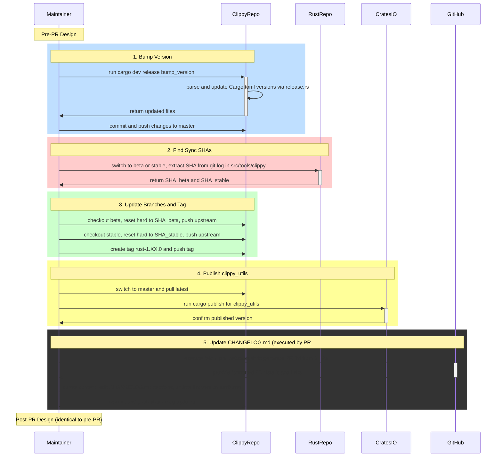

# PR #16158: Workflow Design Impact Analysis

## Affected Workflows
- **release-process (Workflow 8)**: The PR updates `CHANGELOG.md` with new release notes for Clippy 1.92 and modifies lint version attributes in `clippy_lints/src/methods/mod.rs`. This directly corresponds to the documented steps in the release-process workflow, specifically step 5: "Update CHANGELOG.md", which includes editing sections and updating lint `#[clippy::version]` attributes. Evidence from commit diff shows additions to changelog categories (e.g., new lints, false positive fixes) and version bumps from prior versions (1.90.0, 1.88.0) to 1.92.0 for lints `REDUNDANT_ITER_CLONED` and `UNNECESSARY_OPTION_MAP_OR_ELSE`.

No other workflows are impacted, as the changes are metadata and documentation updates tied exclusively to release activities and minor lint metadata adjustment, without altering lint logic, test cases, build scripts, or other components listed in workflows.json.

- **lint-development (Workflow 5)**: The PR modifies `clippy_lints/src/methods/mod.rs`, a file containing lint declarations and implementations for method-related lints. This falls under modifying existing lints, including their metadata such as `#[clippy::version]`, as described in the lint-development workflow components (clippy_lints crate with declare_clippy_lint! invocations defining version, etc.).

## release-process Analysis

### Summary of design changes
No structural changes to the workflow design are introduced or required by this PR. The modifications faithfully execute existing manual curation processes without adding new steps, modifying components, or changing interactions.

- **Specific aspects of the design affected**: None. The PR implements the curation of PR-derived content into CHANGELOG.md categories and the adjustment of lint version metadata, as described in the design document's sequence diagram (step 5).
- **How the PR implements these changes**: 
  - Appends a new "## Clippy 1.92" section to CHANGELOG.md, organizing changes into subsections like "New Lints", "Enhancements", "False Positive Fixes", and "ICE Fixes", with references to source PRs.
  - Updates `#[clippy::version]` in two lint declarations to reflect their inclusion or update in this release version.
  This aligns with the design's emphasis on manual editing for accuracy and usefulness.
- **Potential benefits or implications**: Enhances release quality by providing clear, categorized summaries for users upgrading to 1.92, improves lint traceability for developers, and ensures metadata consistency. No negative implications; supports the workflow's goal of timely, accurate documentation during Rust-integrated releases.

### Updated Mermaid Diagram
The existing Mermaid sequence diagram does not require updates, as no differences exist between the pre-PR and post-PR design. To visualize the lack of change while highlighting the executed portion, the diagram below retains the original structure. The step 5 rectangle (in light blue) represents the unchanged but directly relevant part of the workflow impacted by this PR's changes (no additions in green, changes in yellow, or removals in red needed).

This diagram uses a yellow rectangle for step 5 to indicate the focus of the PR's implementation without altering the flow. Original diagram source: .exp/design-workflow-8-release-process.md.

## lint-development Analysis (Workflow 5)

### Summary of design changes
No changes to the design of the lint-development workflow are introduced by this PR. The modification is a routine update to existing lint metadata rather than altering implementation logic, scaffolding, or integration processes.

- **Specific aspects of the design affected**: None structurally. The update to `#[clippy::version]` attributes in existing lint declarations within `clippy_lints/src/methods/mod.rs` pertains to the metadata defined via `declare_clippy_lint!` macro, a core component for lint registration.
- **How the PR implements these changes**: Changes the version strings for two lints to 1.92.0, likely to reflect updates or stabilization in this release. This is consistent with how metadata is managed during lint modifications.
- **Potential benefits or implications**: Keeps lint version metadata synchronized with release versions, aiding in historical tracking and documentation. No impact on scaffolding (new_lint tool) or execution sequences; reinforces the workflow's modularity for lint maintenance.

### Mermaid Diagram Updates
No updates required for the two Mermaid diagrams (Scaffolding Sequence and Integration and Execution Sequence) in .exp/design-workflow-5-lint-development.md, as the PR does not affect tool invocations, pass registration, or compilation pipeline integration. The change occurs within an existing LintImpl file post-scaffolding.

For reference, the relevant component (clippy_lints/src/methods/mod.rs as part of LintImpl) remains unchanged in structure.

