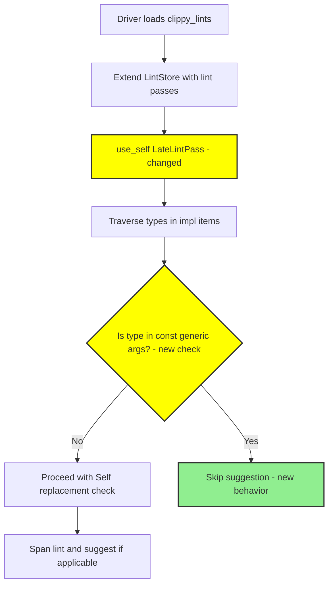
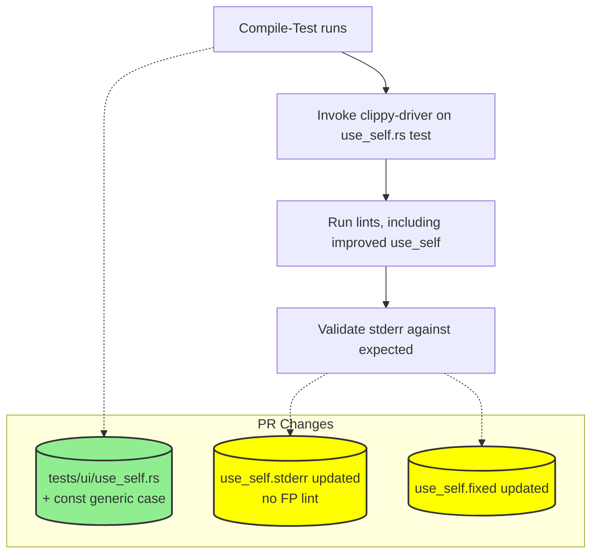

# PR #16172: Workflow Design Impact Analysis

## Affected Workflows
- **Workflow 5: lint-development**: The PR modifies the `use_self` lint implementation in `clippy_lints/src/use_self.rs` to fix a false positive on types in const generics, and updates corresponding UI tests. This directly impacts lint development and integration processes, as `clippy_lints/src/` and `tests/ui/` are key relevant files for this workflow.
- **Workflow 4: testing**: Updates to `tests/ui/use_self.rs`, `tests/ui/use_self.fixed`, and `tests/ui/use_self.stderr` affect the UI test execution, validation, and blessing mechanisms in the testing workflow.

## Workflow 5 Analysis (lint-development)
### Summary of design changes
Specific aspects affected: The lint implementation for `use_self` (a `LateLintPass`) is updated to handle types in const generic parameters correctly, avoiding false positive suggestions of `Self` in those contexts. This refines the analysis logic during the compilation pipeline's lint execution phase.

How the PR implements these changes: 
- Adds import of `rustc_hir::Node`.
- Introduces `ty_is_in_generic_args` function using HIR parent iteration to detect if the type is used in impl const params.
- Adds `ty_contains_ty` for recursive type search in common container types.
- Inserts condition `&& !ty_is_in_generic_args(cx, hir_ty)` in the type checking predicate.

Potential benefits: Increases lint precision for code using const generics, reducing developer confusion from invalid suggestions. Implications: Aligns with Clippy's goal of reliable static analysis; may influence future lint designs handling generics.

The \"Integration and Execution Sequence Diagram\" requires update to highlight the refined lint pass extension and execution.

Updated diagram showing differences (yellow for changes, green for additions):

## Workflow 4 Analysis (testing)
### Summary of design changes
Specific aspects affected: UI test inputs and expected outputs for the `use_self` lint are updated to incorporate a test case for const generics false positive fix.

How the PR implements these changes: 
- `tests/ui/use_self.rs`: Adds or modifies code snippet using const generic type in impl to trigger (previously) FP.
- `tests/ui/use_self.stderr`: Updates to reflect no lint diagnostic emitted post-fix.
- `tests/ui/use_self.fixed`: Adjusts any expected fixed code if suggestions were involved.

Potential benefits: Verifies the lint fix correctness, expands test coverage for generic features, ensures no regressions via output matching. Implications: Strengthens overall test suite robustness.

The \"UI Tests Sequence Diagram\" requires update to note expanded test cases and updated validations.

Updated diagram showing differences:

## Validation
All proposed Mermaid diagrams were validated using `mmdc` (mermaid-cli) to ensure syntactic correctness and renderability to SVG.

No updates to original design documents in `.exp/` are required, as the PR does not alter the high-level workflow designs, sequences, or components—only internal implementation details of a specific lint and its tests.