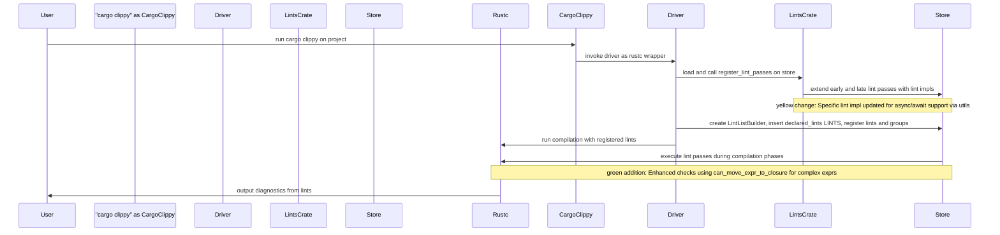
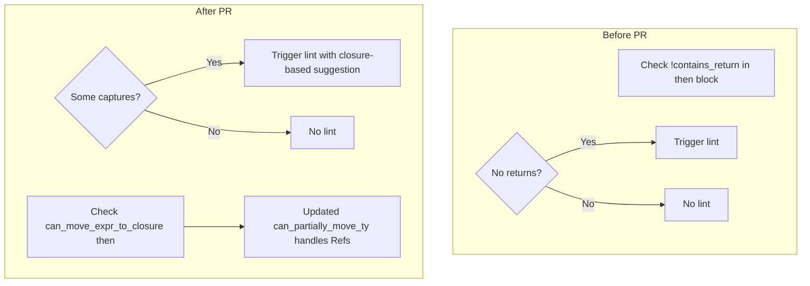
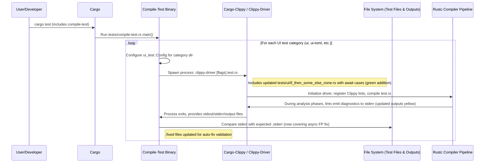

# PR #16178: Workflow Design Impact Analysis

[PR #16178](https://github.com/rust-lang/rust-clippy/pull/16178)

## Affected Workflows
- **lint-development** (Workflow #5): The PR modifies code in `clippy_lints/src/if_then_some_else_none.rs` (lint implementation), `clippy_utils/src/ty/mod.rs` (shared utility), and `tests/ui/if_then_some_else_none.*` (UI tests). These files are listed in the relevant_files for this workflow in `.exp/workflows.json`, and the changes involve modifying an existing lint to handle async `await` cases, aligning with the description: "Develop and integrate new lints or modify existing ones, including registration and testing."

- **testing** (Workflow #4): Updates to `tests/ui/` files directly affect the UI tests execution and validation process, as described in the workflow: "Execute comprehensive tests including ... UI tests ...". The test updates verify the lint fix for await-containing code.

No other workflows are impacted, as their entry points, inputs/outputs, or core sequences do not involve these specific changes. Workflows like `cargo-clippy` and `clippy-driver` will indirectly benefit from the improved lint accuracy but their designs remain unchanged.

## lint-development Analysis

### Summary of design changes
The PR impacts the following aspects of the design documented in `.exp/design-workflow-5-lint-development.md`:

- **Components modified (yellow)**: 
  - `clippy_utils`: Updated `can_partially_move_ty` function to return `false` for `ty::Ref(..)` types, ensuring references are not considered partially movable. This refines type analysis utilities used across lints.
  - `clippy_lints`: In the `if_then_some_else_none` `LateLintPass`, replaced return absence check (`!contains_return`) with `can_move_expr_to_closure(cx, then).is_some()` to correctly handle expressions with `await` (which introduce control flow not detectable by simple return checks but verifiable via closure movability).

- **How the PR implements these changes**: 
  - Adds import of `can_move_expr_to_closure` in lint module.
  - Modifies the lint trigger condition in `check_expr` for `ExprKind::If`.
  - The utility likely traverses the expr tree via `cx` queries to determine if it can be safely captured/moved into a closure, supporting suggestions that work with async (e.g., using `Future::map` instead of `bool::then` which doesn't compose with awaits).
  - Test updates ensure the new logic is verified.

- **Potential benefits or implications**: 
  - Benefits: Fixes false positives in async code, extending the lint's utility to modern async/await patterns common in Rust.
  - Implications: Highlights the role of `clippy_utils` in enabling complex analyses; other lints can adopt similar patterns for better async support. No new workflow steps, but enhances extensibility of lint passes.

No major additions, removals, or sequence changes; the high-level scaffolding and integration sequences remain intact. However, the lint execution within passes is improved.

#### Mermaid diagram showing changes to the workflow
Updated Integration and Execution Sequence Diagram with highlights (no structural changes, but annotations for enhancements):

#### Internal Lint Logic Change Diagram
To illustrate the specific modification within the lint pass:

No updates to `.exp/design-workflow-5-lint-development.md` are required, as the high-level design is unchanged; the PR fits within existing patterns.

## testing Analysis

### Summary of design changes
The PR affects:
- **File System component**: Updated `tests/ui/if_then_some_else_none.rs` to include test cases with `async` functions and `await` in if-then blocks. Corresponding updates to `.stderr` and `.fixed` files reflect the new lint triggers and suggestions without false positives.

- **Interactions**: During UI test execution, the comparison of outputs now validates the fixed behavior for these cases.

How implemented: Added async-specific examples to input file, adjusted expected diagnostic messages and fix applications in output files.

Benefits: Ensures the lint fix is robustly tested, covering edge cases with async code; prevents future regressions.
Implications: Demonstrates how UI tests evolve with lint improvements to maintain coverage.

No changes to sequences or core components; leverages existing `ui_test` framework and compile-test orchestration.

#### Mermaid diagram showing changes to the workflow
Updated UI Tests Sequence Diagram with highlights:

No updates to `.exp/design-workflow-4-testing.md` required, as the design accommodates such test expansions naturally.